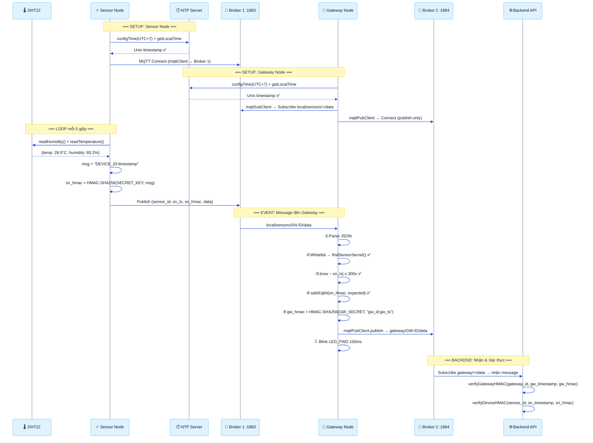
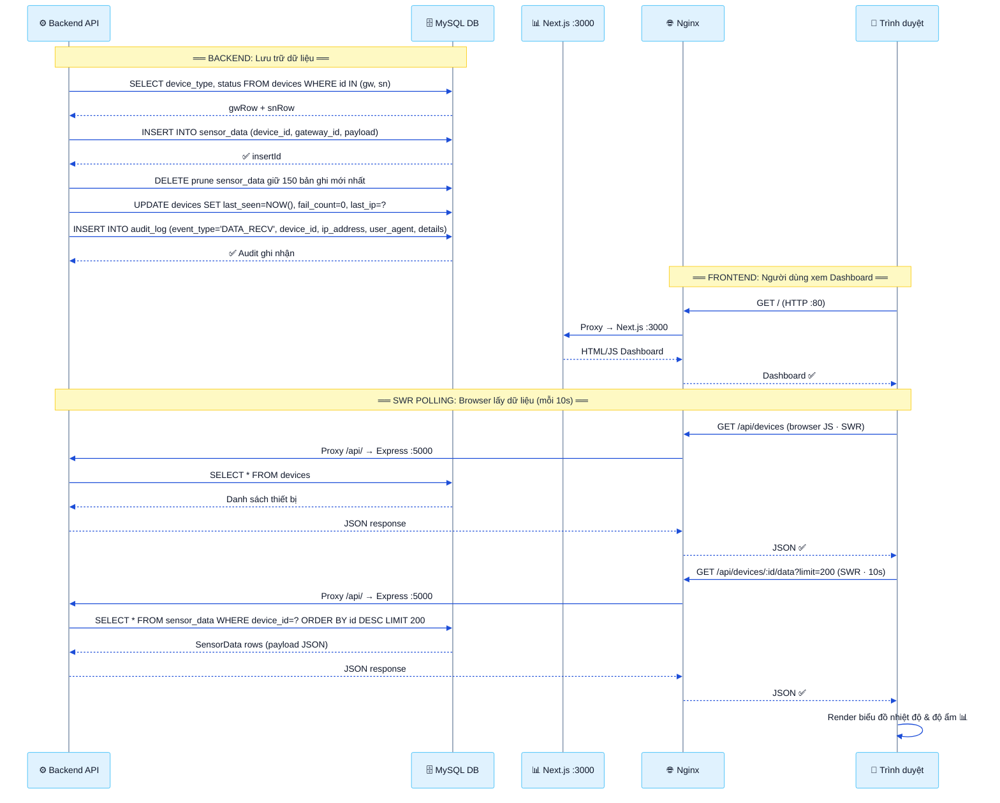
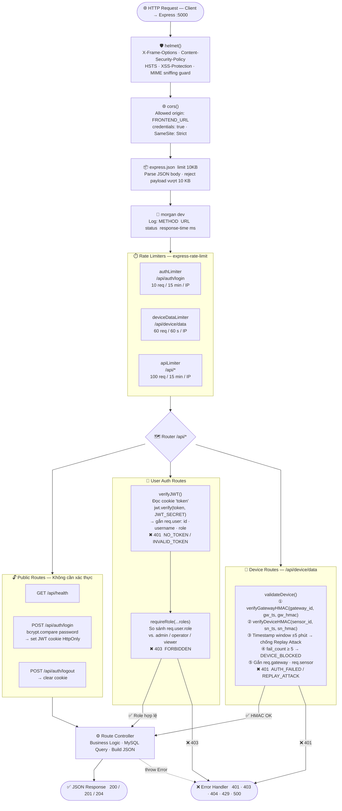

# Diagrams — IoT RBAC Firmware

---

## 1. Luồng End-to-End toàn bộ Firmware

<svg width="860" height="860" viewBox="0 0 860 860" xmlns="http://www.w3.org/2000/svg">
<defs>
  <marker id="a"  markerWidth="8" markerHeight="6" refX="7" refY="3" orient="auto"><polygon points="0 0,8 3,0 6" fill="#2c3e50"/></marker>
  <marker id="ar" markerWidth="8" markerHeight="6" refX="7" refY="3" orient="auto"><polygon points="0 0,8 3,0 6" fill="#7f8c8d"/></marker>
  <marker id="ab" markerWidth="8" markerHeight="6" refX="7" refY="3" orient="auto"><polygon points="0 0,8 3,0 6" fill="#154360"/></marker>
  <marker id="ao" markerWidth="8" markerHeight="6" refX="7" refY="3" orient="auto"><polygon points="0 0,8 3,0 6" fill="#a04000"/></marker>
  <marker id="al" markerWidth="8" markerHeight="6" refX="1" refY="3" orient="auto"><polygon points="8 0,0 3,8 6" fill="#1a5c33"/></marker>
</defs>

<rect x="13" y="66"  width="834" height="276" rx="7" fill="#e8f4fd" fill-opacity=".45" stroke="#2980b9" stroke-width="1.2"/>
<rect x="13" y="352" width="834" height="388" rx="7" fill="#fef9e7" fill-opacity=".55" stroke="#e67e22" stroke-width="1.2"/>
<rect x="13" y="750" width="834" height="96"  rx="7" fill="#eafaf1" fill-opacity=".55" stroke="#27ae60" stroke-width="1.2"/>

<rect x="13" y="66"  width="58"  height="20" rx="3" fill="#2980b9"/>
<text x="42"  y="80" text-anchor="middle" fill="#fff" font-size="11" font-weight="700">INIT</text>
<rect x="13" y="352" width="198" height="20" rx="3" fill="#e67e22"/>
<text x="112" y="366" text-anchor="middle" fill="#fff" font-size="11" font-weight="700">DATA FLOW · per 5 000 ms</text>
<rect x="13" y="750" width="212" height="20" rx="3" fill="#1a7a45"/>
<text x="119" y="764" text-anchor="middle" fill="#fff" font-size="11" font-weight="700">REGISTRY REFRESH · per 5 min</text>

<rect x="18"  y="13" width="108" height="48" rx="5" fill="#7d3c98" stroke="#6c3483" stroke-width="1.5"/>
<text x="72"  y="32" text-anchor="middle" fill="#fff"   font-size="11" font-weight="700">Sensor Node</text>
<text x="72"  y="48" text-anchor="middle" fill="#e8daef" font-size="9">(ESP32 + DHT22)</text>
<rect x="158" y="13" width="108" height="48" rx="5" fill="#154360" stroke="#0d2137" stroke-width="1.5"/>
<text x="212" y="32" text-anchor="middle" fill="#fff"   font-size="11" font-weight="700">Broker 1</text>
<text x="212" y="48" text-anchor="middle" fill="#aed6f1" font-size="9">Mosquitto · :1883</text>
<rect x="308" y="13" width="108" height="48" rx="5" fill="#a04000" stroke="#784212" stroke-width="1.5"/>
<text x="362" y="32" text-anchor="middle" fill="#fff"   font-size="11" font-weight="700">Gateway Node</text>
<text x="362" y="48" text-anchor="middle" fill="#fdebd0" font-size="9">(ESP32)</text>
<rect x="454" y="13" width="108" height="48" rx="5" fill="#154360" stroke="#0d2137" stroke-width="1.5"/>
<text x="508" y="32" text-anchor="middle" fill="#fff"   font-size="11" font-weight="700">Broker 2</text>
<text x="508" y="48" text-anchor="middle" fill="#aed6f1" font-size="9">Mosquitto · :1884</text>
<rect x="600" y="13" width="112" height="48" rx="5" fill="#1a5c33" stroke="#145a32" stroke-width="1.5"/>
<text x="656" y="32" text-anchor="middle" fill="#fff"   font-size="11" font-weight="700">Backend + DB</text>
<text x="656" y="48" text-anchor="middle" fill="#d5f5e3" font-size="9">Express + MySQL</text>

<line x1="72"  y1="61" x2="72"  y2="826" stroke="#7d3c98" stroke-width="1.5" stroke-dasharray="5,4"/>
<line x1="212" y1="61" x2="212" y2="826" stroke="#154360" stroke-width="1.5" stroke-dasharray="5,4"/>
<line x1="362" y1="61" x2="362" y2="826" stroke="#a04000" stroke-width="1.5" stroke-dasharray="5,4"/>
<line x1="508" y1="61" x2="508" y2="826" stroke="#154360" stroke-width="1.5" stroke-dasharray="5,4"/>
<line x1="656" y1="61" x2="656" y2="826" stroke="#1a5c33" stroke-width="1.5" stroke-dasharray="5,4"/>

<!-- INIT -->
<line x1="72" y1="98" x2="204" y2="98" stroke="#2c3e50" stroke-width="1.5" marker-end="url(#a)"/>
<text x="142" y="93" text-anchor="middle" fill="#2c3e50" font-size="10.5" font-weight="600">CONNECT  "sn-{SN_ID}"</text>
<line x1="210" y1="114" x2="80" y2="114" stroke="#7f8c8d" stroke-width="1.5" stroke-dasharray="5,3" marker-end="url(#ar)"/>
<text x="142" y="109" text-anchor="middle" fill="#7f8c8d" font-size="10" font-style="italic">CONNACK</text>
<line x1="362" y1="138" x2="220" y2="138" stroke="#2c3e50" stroke-width="1.5" marker-end="url(#a)"/>
<text x="290" y="133" text-anchor="middle" fill="#2c3e50" font-size="10.5" font-weight="600">CONNECT  "gw-sub-{GW_ID}"</text>
<line x1="206" y1="154" x2="354" y2="154" stroke="#7f8c8d" stroke-width="1.5" stroke-dasharray="5,3" marker-end="url(#ar)"/>
<text x="283" y="149" text-anchor="middle" fill="#7f8c8d" font-size="10" font-style="italic">CONNACK</text>
<line x1="362" y1="174" x2="220" y2="174" stroke="#2c3e50" stroke-width="1.5" marker-end="url(#a)"/>
<text x="290" y="169" text-anchor="middle" fill="#2c3e50" font-size="10.5" font-weight="600">SUBSCRIBE  local/sensors/+/data</text>
<line x1="206" y1="190" x2="354" y2="190" stroke="#7f8c8d" stroke-width="1.5" stroke-dasharray="5,3" marker-end="url(#ar)"/>
<text x="283" y="185" text-anchor="middle" fill="#7f8c8d" font-size="10" font-style="italic">SUBACK</text>
<line x1="362" y1="210" x2="500" y2="210" stroke="#2c3e50" stroke-width="1.5" marker-end="url(#a)"/>
<text x="430" y="205" text-anchor="middle" fill="#2c3e50" font-size="10.5" font-weight="600">CONNECT  "gw-{GW_ID}"</text>
<line x1="506" y1="226" x2="370" y2="226" stroke="#7f8c8d" stroke-width="1.5" stroke-dasharray="5,3" marker-end="url(#ar)"/>
<text x="430" y="221" text-anchor="middle" fill="#7f8c8d" font-size="10" font-style="italic">CONNACK</text>
<line x1="362" y1="254" x2="648" y2="254" stroke="#2c3e50" stroke-width="1.5" marker-end="url(#a)"/>
<text x="505" y="249" text-anchor="middle" fill="#2c3e50" font-size="10.5" font-weight="600">GET /api/device/sensors</text>
<rect x="368" y="258" width="278" height="16" rx="3" fill="#fdebd0" stroke="#a04000" stroke-width="1"/>
<text x="507" y="269" text-anchor="middle" fill="#784212" font-size="8.5">?gateway_id=…&amp;gw_timestamp=…&amp;gw_hmac=[HMAC-SHA256]</text>
<line x1="654" y1="290" x2="370" y2="290" stroke="#7f8c8d" stroke-width="1.5" stroke-dasharray="5,3" marker-end="url(#ar)"/>
<text x="505" y="285" text-anchor="middle" fill="#7f8c8d" font-size="10" font-style="italic">200 OK · { sensors: [ { device_id, secret_key } ] }</text>
<rect x="278" y="300" width="184" height="17" rx="3" fill="#fdebd0" stroke="#a04000" stroke-width="1"/>
<text x="370" y="311" text-anchor="middle" fill="#784212" font-size="9">Store sensor_registry (max 16, TTL = 5 min)</text>

<!-- DATA FLOW -->
<rect x="17" y="372" width="222" height="18" rx="3" fill="#f5eef8" stroke="#7d3c98" stroke-width="1"/>
<text x="128" y="384" text-anchor="middle" fill="#6c3483" font-size="9.5">readSensor() → HMAC(SECRET, "SN_ID:sn_ts")</text>
<line x1="72" y1="406" x2="204" y2="406" stroke="#7d3c98" stroke-width="1.5" marker-end="url(#a)"/>
<text x="142" y="399" text-anchor="middle" fill="#2c3e50" font-size="10" font-weight="600">PUBLISH  local/sensors/{SN_ID}/data</text>
<rect x="17" y="410" width="228" height="16" rx="3" fill="#f5eef8" stroke="#7d3c98" stroke-width="1"/>
<text x="131" y="421" text-anchor="middle" fill="#6c3483" font-size="8.5">{ sensor_id, sn_ts, sn_hmac, sensor_ip, data:{T,H} }</text>
<line x1="214" y1="442" x2="354" y2="442" stroke="#154360" stroke-width="1.5" marker-end="url(#ab)"/>
<text x="283" y="435" text-anchor="middle" fill="#154360" font-size="10.5" font-weight="600">DELIVER (subscribed match)</text>
<text x="283" y="451" text-anchor="middle" fill="#7f8c8d" font-size="8.5">→ onSensorMessage() callback</text>
<rect x="357" y="462" width="10" height="96" rx="2" fill="#a04000" fill-opacity=".8"/>
<rect x="372" y="462" width="186" height="96" rx="5" fill="#fff8f0" stroke="#a04000" stroke-width="1.5"/>
<text x="465" y="477" text-anchor="middle" fill="#a04000" font-size="9.5" font-weight="700">forwardSensorData()</text>
<text x="465" y="491" text-anchor="middle" fill="#5d4037" font-size="8.5">① Parse JSON payload</text>
<text x="465" y="504" text-anchor="middle" fill="#5d4037" font-size="8.5">② Lookup sensor registry + fallback</text>
<text x="465" y="517" text-anchor="middle" fill="#5d4037" font-size="8.5">③ |now − sn_ts| ≤ 300 s (anti-replay)</text>
<text x="465" y="530" text-anchor="middle" fill="#5d4037" font-size="8.5">④ Verify HMAC-SHA256 (constant-time)</text>
<text x="465" y="545" text-anchor="middle" fill="#c0392b" font-size="8.5" font-weight="600">✗ fail → drop packet + log Serial</text>
<rect x="276" y="570" width="202" height="17" rx="3" fill="#fdebd0" stroke="#a04000" stroke-width="1"/>
<text x="377" y="581" text-anchor="middle" fill="#784212" font-size="9">HMAC(GW_SECRET, "GW_ID:gw_ts") → gw_hmac</text>
<line x1="362" y1="600" x2="500" y2="600" stroke="#a04000" stroke-width="1.5" marker-end="url(#ao)"/>
<text x="430" y="593" text-anchor="middle" fill="#2c3e50" font-size="10" font-weight="600">PUBLISH  gateway/{GW_ID}/data</text>
<rect x="276" y="604" width="278" height="16" rx="3" fill="#fdebd0" stroke="#a04000" stroke-width="1"/>
<text x="415" y="615" text-anchor="middle" fill="#784212" font-size="8.5">{ gw_id, gateway_ip, gw_ts, gw_hmac, sensor_payload:{…} }</text>
<line x1="510" y1="636" x2="648" y2="636" stroke="#154360" stroke-width="1.5" marker-end="url(#ab)"/>
<text x="578" y="629" text-anchor="middle" fill="#154360" font-size="10.5" font-weight="600">DELIVER  gateway/+/data</text>
<text x="578" y="645" text-anchor="middle" fill="#7f8c8d" font-size="8.5">→ deviceStatus service callback</text>
<rect x="651" y="656" width="10" height="82" rx="2" fill="#1a5c33" fill-opacity=".8"/>
<rect x="456" y="656" width="190" height="82" rx="5" fill="#e8f8f5" stroke="#1a5c33" stroke-width="1.5"/>
<text x="551" y="671" text-anchor="middle" fill="#1a5c33" font-size="9.5" font-weight="700">validateDevice() middleware</text>
<text x="551" y="685" text-anchor="middle" fill="#0e6655" font-size="8.5">① Verify gateway HMAC-SHA256</text>
<text x="551" y="698" text-anchor="middle" fill="#0e6655" font-size="8.5">② Verify sensor HMAC-SHA256</text>
<text x="551" y="711" text-anchor="middle" fill="#0e6655" font-size="8.5">③ Timestamp window ± 300 s</text>
<text x="551" y="724" text-anchor="middle" fill="#0e6655" font-size="8.5">④ Device type + status = active</text>
<polyline points="656,748 696,748 696,764 664,764" stroke="#1a5c33" stroke-width="1.5" fill="none" marker-end="url(#al)"/>
<text x="700" y="754" fill="#1a5c33" font-size="9" font-weight="600">INSERT sensor_data</text>
<polyline points="656,772 696,772 696,788 664,788" stroke="#1a5c33" stroke-width="1.5" fill="none" marker-end="url(#al)"/>
<text x="700" y="779" fill="#1a5c33" font-size="9" font-weight="600">UPDATE last_seen · PRUNE keep 150</text>

<!-- REGISTRY REFRESH -->
<line x1="362" y1="790" x2="648" y2="790" stroke="#2c3e50" stroke-width="1.5" marker-end="url(#a)"/>
<text x="505" y="783" text-anchor="middle" fill="#2c3e50" font-size="10.5" font-weight="600">GET /api/device/sensors  (new HMAC · new ts)</text>
<line x1="654" y1="810" x2="370" y2="810" stroke="#7f8c8d" stroke-width="1.5" stroke-dasharray="5,3" marker-end="url(#ar)"/>
<text x="505" y="805" text-anchor="middle" fill="#7f8c8d" font-size="10" font-style="italic">200 OK · updated sensor list · reset TTL timer</text>

<rect x="18"  y="828" width="108" height="26" rx="4" fill="#7d3c98" stroke="#6c3483" stroke-width="1.2"/>
<text x="72"  y="845" text-anchor="middle" fill="#fff" font-size="9.5" font-weight="600">Sensor Node</text>
<rect x="158" y="828" width="108" height="26" rx="4" fill="#154360" stroke="#0d2137" stroke-width="1.2"/>
<text x="212" y="845" text-anchor="middle" fill="#fff" font-size="9.5" font-weight="600">Broker 1</text>
<rect x="308" y="828" width="108" height="26" rx="4" fill="#a04000" stroke="#784212" stroke-width="1.2"/>
<text x="362" y="845" text-anchor="middle" fill="#fff" font-size="9.5" font-weight="600">Gateway Node</text>
<rect x="454" y="828" width="108" height="26" rx="4" fill="#154360" stroke="#0d2137" stroke-width="1.2"/>
<text x="508" y="845" text-anchor="middle" fill="#fff" font-size="9.5" font-weight="600">Broker 2</text>
<rect x="600" y="828" width="112" height="26" rx="4" fill="#1a5c33" stroke="#145a32" stroke-width="1.2"/>
<text x="656" y="845" text-anchor="middle" fill="#fff" font-size="9.5" font-weight="600">Backend + DB</text>
</svg>

**Luồng End-to-End toàn bộ Firmware.**
Giai đoạn **INIT**: Sensor Node kết nối Broker 1 (port 1883); Gateway kết nối song song cả hai Broker, subscribe `local/sensors/+/data`, rồi gọi HTTP GET có xác thực HMAC để tải sensor registry từ Backend (tối đa 16 entry, TTL = 5 phút).
Giai đoạn **Data Flow** (mỗi 5 000 ms): Sensor ký payload bằng HMAC-SHA256 (mbedTLS) rồi publish lên Broker 1; Gateway nhận qua `onSensorMessage()`, thực hiện **4 bước kiểm tra** trong `forwardSensorData()` (parse → registry → window ±300 s → constant-time HMAC verify), ký thêm Gateway HMAC rồi forward lên Broker 2 (port 1884); Backend nhận qua `validateDevice()` middleware, xác thực lại cả hai lớp HMAC, ghi MySQL và duy trì 150 bản ghi gần nhất mỗi sensor.
Giai đoạn **Registry Refresh**: mỗi 5 phút Gateway tự làm mới danh sách sensor để nhận thiết bị mới đăng ký mà không cần khởi động lại.

---

## 2. E2E Part 1 — Firmware → Backend

---

## 3. E2E Part 2 — Backend → Browser

---

## 4. Middleware Chain

---

## 5. Sequence Diagram — Sensor Node (ESP32)

<svg width="900" height="820" viewBox="0 0 900 820" xmlns="http://www.w3.org/2000/svg">
<defs>
  <marker id="b" markerWidth="8" markerHeight="6" refX="7" refY="3" orient="auto">
    <polygon points="0 0,8 3,0 6" fill="#2c3e50"/>
  </marker>
  <marker id="br" markerWidth="8" markerHeight="6" refX="7" refY="3" orient="auto">
    <polygon points="0 0,8 3,0 6" fill="#7f8c8d"/>
  </marker>
  <marker id="bo" markerWidth="8" markerHeight="6" refX="7" refY="3" orient="auto">
    <polygon points="0 0,8 3,0 6" fill="#d35400"/>
  </marker>
  <marker id="bs" markerWidth="8" markerHeight="6" refX="7" refY="3" orient="auto">
    <polygon points="0 0,8 3,0 6" fill="#e67e22"/>
  </marker>
</defs>

<rect x="16" y="62" width="868" height="358" rx="6" fill="#e8f4fd" fill-opacity="0.45" stroke="#5dade2" stroke-width="1.2"/>
<rect x="16" y="430" width="868" height="372" rx="6" fill="#eafaf1" fill-opacity="0.45" stroke="#27ae60" stroke-width="1.2"/>

<rect x="16" y="62" width="76" height="20" rx="3" fill="#2980b9"/>
<text x="54" y="76" text-anchor="middle" fill="#fff" font-size="11" font-weight="700">SETUP</text>
<rect x="16" y="430" width="138" height="20" rx="3" fill="#1a7a45"/>
<text x="85" y="444" text-anchor="middle" fill="#fff" font-size="11" font-weight="700">LOOP · 5 000 ms</text>

<rect x="24"  y="13" width="108" height="44" rx="5" fill="#2c3e50" stroke="#1a252f" stroke-width="1.5"/>
<text x="78"  y="32" text-anchor="middle" fill="#fff"   font-size="11" font-weight="700">Main</text>
<text x="78"  y="48" text-anchor="middle" fill="#bdc3c7" font-size="9">(main.cpp)</text>
<rect x="144" y="13" width="108" height="44" rx="5" fill="#2980b9" stroke="#1a5276" stroke-width="1.5"/>
<text x="198" y="32" text-anchor="middle" fill="#fff"   font-size="11" font-weight="700">WiFiManager</text>
<text x="198" y="48" text-anchor="middle" fill="#d6eaf8" font-size="9">(wifi_manager)</text>
<rect x="264" y="13" width="108" height="44" rx="5" fill="#2980b9" stroke="#1a5276" stroke-width="1.5"/>
<text x="318" y="32" text-anchor="middle" fill="#fff"   font-size="11" font-weight="700">NTPSync</text>
<text x="318" y="48" text-anchor="middle" fill="#d6eaf8" font-size="9">(ntp_sync)</text>
<rect x="380" y="13" width="108" height="44" rx="5" fill="#7d3c98" stroke="#6c3483" stroke-width="1.5"/>
<text x="434" y="32" text-anchor="middle" fill="#fff"   font-size="11" font-weight="700">DHT22</text>
<text x="434" y="48" text-anchor="middle" fill="#e8daef" font-size="9">(sensor_reader)</text>
<rect x="496" y="13" width="108" height="44" rx="5" fill="#c0392b" stroke="#922b21" stroke-width="1.5"/>
<text x="550" y="32" text-anchor="middle" fill="#fff"   font-size="11" font-weight="700">mbedTLS</text>
<text x="550" y="48" text-anchor="middle" fill="#fadbd8" font-size="9">(hmac_util)</text>
<rect x="610" y="13" width="108" height="44" rx="5" fill="#d35400" stroke="#a04000" stroke-width="1.5"/>
<text x="664" y="32" text-anchor="middle" fill="#fff"   font-size="11" font-weight="700">MQTTSender</text>
<text x="664" y="48" text-anchor="middle" fill="#fdebd0" font-size="9">(mqtt_sender)</text>
<rect x="726" y="13" width="108" height="44" rx="5" fill="#27ae60" stroke="#1e8449" stroke-width="1.5"/>
<text x="780" y="32" text-anchor="middle" fill="#fff"   font-size="11" font-weight="700">MQTT Broker</text>
<text x="780" y="48" text-anchor="middle" fill="#d5f5e3" font-size="9">(nội bộ)</text>

<line x1="78"  y1="57" x2="78"  y2="808" stroke="#2c3e50" stroke-width="1.5" stroke-dasharray="5,4"/>
<line x1="198" y1="57" x2="198" y2="808" stroke="#2980b9" stroke-width="1.5" stroke-dasharray="5,4"/>
<line x1="318" y1="57" x2="318" y2="808" stroke="#2980b9" stroke-width="1.5" stroke-dasharray="5,4"/>
<line x1="434" y1="57" x2="434" y2="808" stroke="#7d3c98" stroke-width="1.5" stroke-dasharray="5,4"/>
<line x1="550" y1="57" x2="550" y2="808" stroke="#c0392b" stroke-width="1.5" stroke-dasharray="5,4"/>
<line x1="664" y1="57" x2="664" y2="808" stroke="#d35400" stroke-width="1.5" stroke-dasharray="5,4"/>
<line x1="780" y1="57" x2="780" y2="808" stroke="#27ae60" stroke-width="1.5" stroke-dasharray="5,4"/>

<!-- SETUP -->
<line x1="78" y1="100" x2="190" y2="100" stroke="#2c3e50" stroke-width="1.5" marker-end="url(#b)"/>
<text x="134" y="95" text-anchor="middle" fill="#2c3e50" font-size="10.5" font-weight="600">wifiSetup()</text>
<rect x="204" y="88" width="180" height="28" rx="3" fill="#fef9e7" stroke="#f0b429" stroke-width="1"/>
<text x="294" y="101" text-anchor="middle" fill="#7d6608" font-size="9.5">WiFi.begin(SSID, PASS)</text>
<text x="294" y="112" text-anchor="middle" fill="#7d6608" font-size="9">retry 500 ms × 40 → WL_CONNECTED</text>
<line x1="196" y1="148" x2="86" y2="148" stroke="#7f8c8d" stroke-width="1.5" stroke-dasharray="6,3" marker-end="url(#br)"/>
<text x="134" y="143" text-anchor="middle" fill="#7f8c8d" font-size="10" font-style="italic">«connected»</text>
<line x1="78" y1="182" x2="310" y2="182" stroke="#2c3e50" stroke-width="1.5" marker-end="url(#b)"/>
<text x="194" y="177" text-anchor="middle" fill="#2c3e50" font-size="10.5" font-weight="600">ntpSetup()</text>
<rect x="324" y="170" width="200" height="28" rx="3" fill="#fef9e7" stroke="#f0b429" stroke-width="1"/>
<text x="424" y="183" text-anchor="middle" fill="#7d6608" font-size="9.5">configTime(UTC+7, pool.ntp.org)</text>
<text x="424" y="194" text-anchor="middle" fill="#7d6608" font-size="9">retry 500 ms × 20 → getLocalTime()</text>
<line x1="316" y1="230" x2="86" y2="230" stroke="#7f8c8d" stroke-width="1.5" stroke-dasharray="6,3" marker-end="url(#br)"/>
<text x="194" y="225" text-anchor="middle" fill="#7f8c8d" font-size="10" font-style="italic">«synced · UTC+7»</text>
<line x1="78" y1="263" x2="426" y2="263" stroke="#2c3e50" stroke-width="1.5" marker-end="url(#b)"/>
<text x="252" y="258" text-anchor="middle" fill="#2c3e50" font-size="10.5" font-weight="600">sensorSetup()</text>
<rect x="446" y="253" width="155" height="22" rx="3" fill="#f5eef8" stroke="#7d3c98" stroke-width="1"/>
<text x="524" y="268" text-anchor="middle" fill="#6c3483" font-size="9">dht.begin() + delay 2 000 ms</text>
<line x1="432" y1="299" x2="86" y2="299" stroke="#7f8c8d" stroke-width="1.5" stroke-dasharray="6,3" marker-end="url(#br)"/>
<text x="252" y="294" text-anchor="middle" fill="#7f8c8d" font-size="10" font-style="italic">«ready»</text>
<line x1="78" y1="332" x2="656" y2="332" stroke="#2c3e50" stroke-width="1.5" marker-end="url(#b)"/>
<text x="367" y="327" text-anchor="middle" fill="#2c3e50" font-size="10.5" font-weight="600">mqttSetup()</text>
<rect x="530" y="338" width="192" height="18" rx="3" fill="#fdebd0" stroke="#d35400" stroke-width="1"/>
<text x="626" y="350" text-anchor="middle" fill="#a04000" font-size="9">setServer(HOST, 1883) + setBufferSize(512)</text>
<line x1="662" y1="370" x2="86" y2="370" stroke="#7f8c8d" stroke-width="1.5" stroke-dasharray="6,3" marker-end="url(#br)"/>
<text x="367" y="365" text-anchor="middle" fill="#7f8c8d" font-size="10" font-style="italic">«configured»</text>

<!-- LOOP -->
<rect x="24" y="455" width="138" height="18" rx="3" fill="none" stroke="#1a7a45" stroke-width="1" stroke-dasharray="3,2"/>
<text x="93" y="467" text-anchor="middle" fill="#1a7a45" font-size="9.5" font-style="italic">[millis() – last ≥ 5 000 ms]</text>
<line x1="78" y1="490" x2="190" y2="490" stroke="#2c3e50" stroke-width="1.5" marker-end="url(#b)"/>
<text x="134" y="485" text-anchor="middle" fill="#2c3e50" font-size="10.5" font-weight="600">wifiMaintain()</text>
<line x1="196" y1="508" x2="86" y2="508" stroke="#7f8c8d" stroke-width="1.5" stroke-dasharray="6,3" marker-end="url(#br)"/>
<text x="134" y="503" text-anchor="middle" fill="#7f8c8d" font-size="9.5" font-style="italic">WiFi.reconnect() nếu cần</text>
<line x1="78" y1="530" x2="656" y2="530" stroke="#2c3e50" stroke-width="1.5" marker-end="url(#b)"/>
<text x="367" y="525" text-anchor="middle" fill="#2c3e50" font-size="10.5" font-weight="600">mqttMaintain()</text>
<line x1="664" y1="550" x2="772" y2="550" stroke="#d35400" stroke-width="1.5" marker-end="url(#bo)"/>
<text x="718" y="545" text-anchor="middle" fill="#d35400" font-size="10" font-weight="600">CONNECT  clientId="sn-{ID}"</text>
<line x1="778" y1="568" x2="672" y2="568" stroke="#7f8c8d" stroke-width="1.5" stroke-dasharray="6,3" marker-end="url(#br)"/>
<text x="718" y="563" text-anchor="middle" fill="#7f8c8d" font-size="10" font-style="italic">CONNACK</text>
<rect x="24" y="588" width="856" height="20" rx="3" fill="#d5f5e3" fill-opacity="0.8" stroke="#27ae60" stroke-width="1" stroke-dasharray="4,2"/>
<text x="452" y="601" text-anchor="middle" fill="#1a5c33" font-size="9.5" font-weight="600">[wifiIsConnected() ∧ ntpIsSynced() ∧ mqttIsConnected() ∧ data.valid == true]</text>
<line x1="78" y1="622" x2="426" y2="622" stroke="#2c3e50" stroke-width="1.5" marker-end="url(#b)"/>
<text x="252" y="617" text-anchor="middle" fill="#2c3e50" font-size="10.5" font-weight="600">readSensor()</text>
<line x1="432" y1="642" x2="86" y2="642" stroke="#7f8c8d" stroke-width="1.5" stroke-dasharray="6,3" marker-end="url(#br)"/>
<text x="252" y="637" text-anchor="middle" fill="#7f8c8d" font-size="10" font-style="italic">SensorData { temp, hum, valid=true }</text>
<line x1="78" y1="666" x2="542" y2="666" stroke="#2c3e50" stroke-width="1.5" marker-end="url(#b)"/>
<text x="310" y="661" text-anchor="middle" fill="#2c3e50" font-size="10.5" font-weight="600">computeHMAC(SECRET_KEY, "DEVICE_ID:ts")</text>
<line x1="548" y1="686" x2="86" y2="686" stroke="#7f8c8d" stroke-width="1.5" stroke-dasharray="6,3" marker-end="url(#br)"/>
<text x="310" y="681" text-anchor="middle" fill="#7f8c8d" font-size="10" font-style="italic">hmac_hex  (HMAC-SHA256, 64 ký tự)</text>
<line x1="78" y1="710" x2="656" y2="710" stroke="#2c3e50" stroke-width="1.5" marker-end="url(#b)"/>
<text x="367" y="705" text-anchor="middle" fill="#2c3e50" font-size="10.5" font-weight="600">mqttPublishSensorData(data)</text>
<line x1="664" y1="730" x2="772" y2="730" stroke="#d35400" stroke-width="1.5" marker-end="url(#bo)"/>
<text x="718" y="725" text-anchor="middle" fill="#d35400" font-size="10" font-weight="600">PUBLISH local/sensors/{ID}/data</text>
<rect x="616" y="736" width="232" height="16" rx="2" fill="#fdebd0" stroke="none"/>
<text x="732" y="747" text-anchor="middle" fill="#a04000" font-size="8.5">{ sensor_id, sn_timestamp, sn_hmac, sensor_ip, data }</text>
<line x1="778" y1="762" x2="672" y2="762" stroke="#7f8c8d" stroke-width="1.5" stroke-dasharray="6,3" marker-end="url(#br)"/>
<text x="718" y="757" text-anchor="middle" fill="#7f8c8d" font-size="10" font-style="italic">PUBACK (QoS 0)</text>
<line x1="662" y1="782" x2="86" y2="782" stroke="#7f8c8d" stroke-width="1.5" stroke-dasharray="6,3" marker-end="url(#br)"/>
<text x="367" y="777" text-anchor="middle" fill="#7f8c8d" font-size="10" font-style="italic">true  (publish OK)</text>
<polyline points="78,798 52,798 52,810 70,810" stroke="#e67e22" stroke-width="1.5" fill="none" marker-end="url(#bs)"/>
<rect x="24" y="804" width="170" height="16" rx="3" fill="#fef3e2" stroke="#e67e22" stroke-width="1"/>
<text x="109" y="815" text-anchor="middle" fill="#d35400" font-size="9.5" font-weight="600">LED GPIO2: HIGH 100 ms → LOW</text>
</svg>

**Hình 2.7:** Sequence Diagram luồng hoạt động Sensor Node (ESP32 DOIT DevKit V1).
Giai đoạn **Setup**: kết nối WiFi (retry cố định 500 ms × 40), đồng bộ NTP UTC+7 (retry 500 ms × 20), khởi tạo DHT22 warmup 2 s, cấu hình MQTT client.
Giai đoạn **Loop** (mỗi 5 000 ms): duy trì kết nối nền, kiểm tra 4 điều kiện, đọc DHT22 → ký HMAC-SHA256 (mbedTLS) → đóng gói JSON → PUBLISH lên Broker → nháy LED GPIO2 xác nhận.
