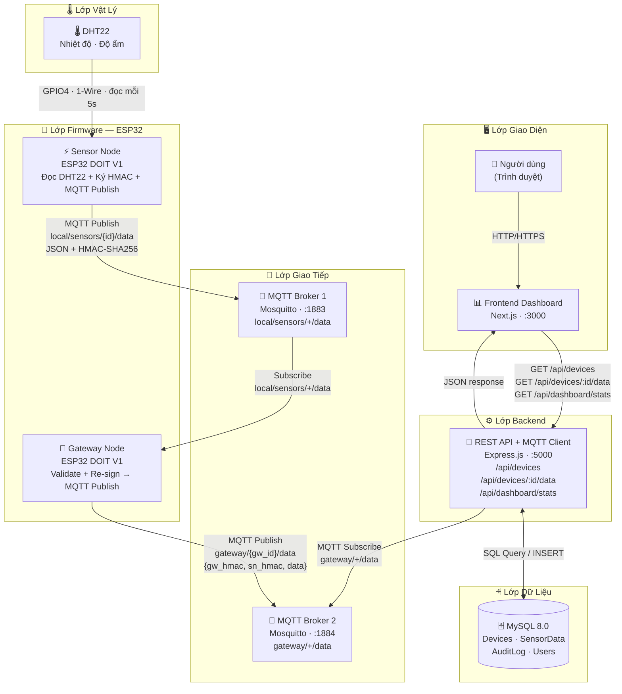
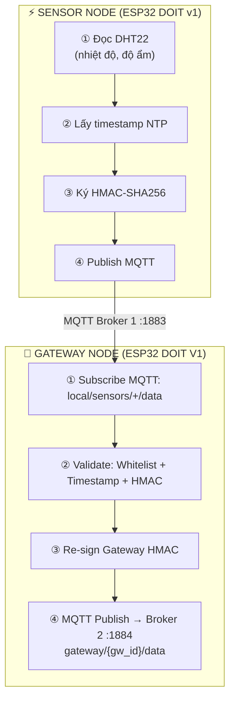
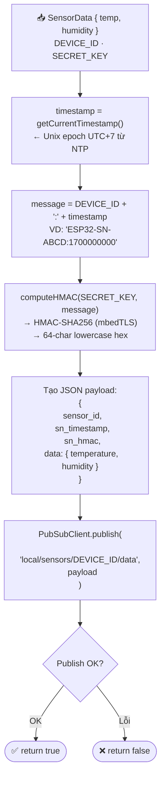
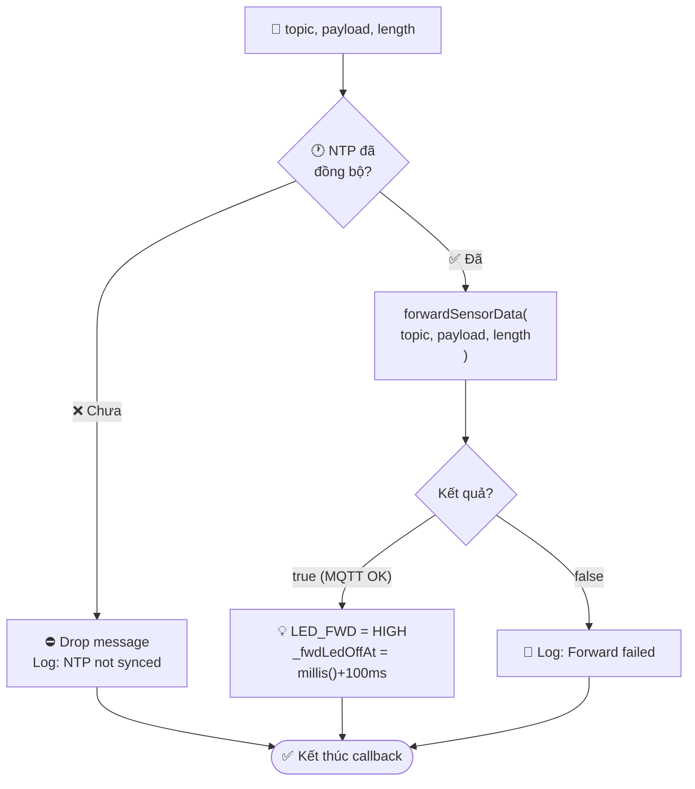
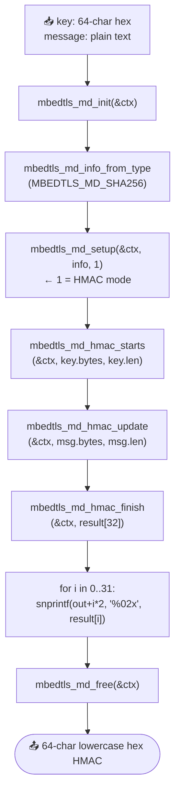
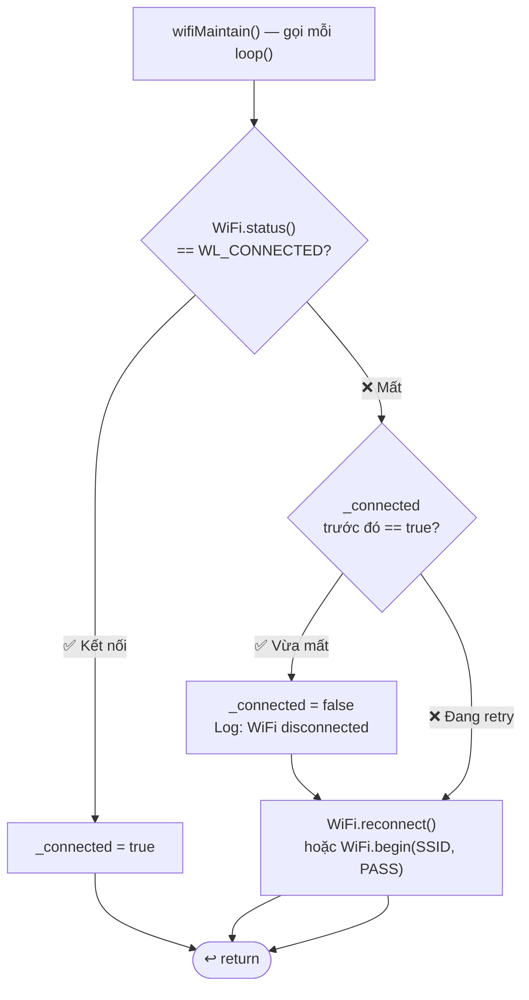
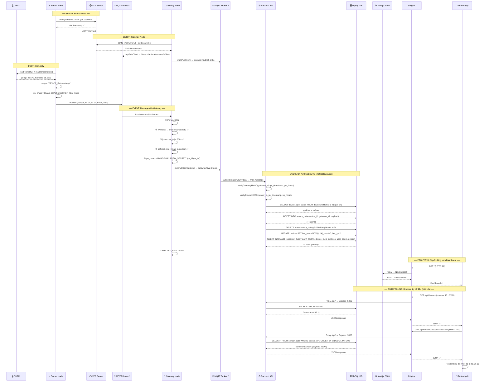

# Lưu Đồ Thuật Toán Firmware — IoT Manager

> Đọc theo thứ tự: **Tổng quan → Sensor Node → Gateway Node → Dùng chung → End-to-End → Bảo mật**

---

## I. TỔNG QUAN HỆ THỐNG

### I.1 Kiến Trúc & Luồng Dữ Liệu

```mermaid
flowchart LR
    DHT22["🌡️ DHT22\nSensor"]
    SN["⚡ Sensor Node\nESP32 DOIT V1"]
    BROKER1["📡 MQTT Broker 1\nMosquitto :1883"]
    GW["🔀 Gateway Node\nESP32 DOIT V1"]
    BROKER2["📡 MQTT Broker 2\nMosquitto :1884"]
    BE["⚙️ Backend API\nExpress.js :5000"]
    DB["🗄️ Database\nMySQL 8.0"]
    FE["📊 Dashboard\nNext.js :3000"]

    DHT22 -->|"GPIO4 · 1-Wire"| SN
    SN -->|"MQTT Publish\nJSON + HMAC-SHA256\ntopic: local/sensors/{id}/data"| BROKER1
    BROKER1 -->|"MQTT Subscribe\nwildcard: local/sensors/+/data"| GW
    GW -->|"Validate → Re-sign\nMQTT Publish: gateway/{gw_id}/data"| BROKER2
    BROKER2 -->|"MQTT Subscribe\nwildcard: gateway/+/data"| BE
    BE --> DB --> FE
```

### I.2 Sơ Đồ Toàn Hệ Thống — Full Stack (Frontend → Backend → DB → Firmware)

---

### I.3 Phân Chia Trách Nhiệm

---

## II. SENSOR NODE (ESP32 DOIT v1)

### II.1 Khởi Động — setup()

### II.2 Vòng Lặp Chính — loop() · 5000ms

### II.3 Đóng Gói & Publish — mqttPublishSensorData()

---

## III. GATEWAY NODE (ESP32 DOIT V1)

### III.1 Khởi Động — setup()

### III.2 Vòng Lặp Chính — loop() · Event-driven

### III.3 Xử Lý Message — onSensorMessage()

### III.4 Pipeline Validate & Forward — forwardSensorData()

---

## IV. DÙNG CHUNG — CẢ HAI NODE

### IV.1 HMAC-SHA256 — computeHMAC() (mbedTLS)

> Dùng ở cả **Sensor Node** (ký dữ liệu) và **Gateway Node** (verify + re-sign)

### IV.2 Constant-Time Compare — safeEq64()

> Chỉ dùng ở **Gateway Node** (bước xác minh HMAC)

> ⚠️ **Lý do:** `strcmp()` dừng ở byte đầu tiên khác nhau — kẻ tấn công đo thời gian để đoán từng ký tự HMAC (Timing Attack). `safeEq64()` luôn chạy đúng 64 iteration.

### IV.3 WiFi Auto-Reconnect — wifiMaintain()

> Gọi mỗi `loop()` ở **cả hai node**. Gateway dùng interval 10s, Sensor Node reconnect ngay.

### IV.4 Đồng Bộ NTP — ntpSetup()

> Gọi một lần trong `setup()` ở **cả hai node**. NTP là tiền điều kiện để HMAC timestamp hợp lệ.

---

## V. END-TO-END — Luồng Hoàn Chỉnh

---

## VI. BẢO MẬT — Tổng Hợp

| Cơ Chế | Node Áp Dụng | Mô Tả | Chống |
|---------|-------------|--------|-------|
| **HMAC-SHA256** | Cả hai | Ký/xác minh payload với secret key 256-bit | Giả mạo dữ liệu |
| **Timestamp Window ±300s** | Gateway | Từ chối message cũ hơn 5 phút | Replay Attack |
| **Constant-Time Compare** | Gateway | `safeEq64()` — không dừng sớm | Timing Attack |
| **Sensor Whitelist** | Gateway | `KNOWN_SENSORS[]` cục bộ + dynamic fetch từ `/api/device/sensors` mỗi 5 phút | Thiết bị giả mạo |
| **Dual Signature** | Gateway | Gửi cả sn_hmac + gw_hmac lên backend | Giả mạo gateway |
| **Unique Keys** | Cả hai | Mỗi thiết bị có secret key riêng từ server | Blast radius khi lộ key |
