# Lưu Đồ Thuật Toán Firmware — IoT Manager

> Đọc theo thứ tự: **Tổng quan → Sensor Node → Gateway Node → Dùng chung → End-to-End → Bảo mật**

---

## I. TỔNG QUAN HỆ THỐNG

### I.1 Kiến Trúc & Luồng Dữ Liệu

```mermaid
flowchart LR
    DHT22["🌡️ DHT22\nSensor"]
    SN["⚡ Sensor Node\nESP32 DOIT V1"]
    BROKER1["📡 MQTT Broker 1\nMosquitto :1883"]
    GW["🔀 Gateway Node\nESP32 DOIT V1"]
    BROKER2["📡 MQTT Broker 2\nMosquitto :1884"]
    BE["⚙️ Backend API\nExpress.js :5000"]
    DB["🗄️ Database\nMySQL 8.0"]
    FE["📊 Dashboard\nNext.js :3000"]

    DHT22 -->|"GPIO4 · 1-Wire"| SN
    SN -->|"MQTT Publish\nJSON + HMAC-SHA256\ntopic: local/sensors/{id}/data"| BROKER1
    BROKER1 -->|"MQTT Subscribe\nwildcard: local/sensors/+/data"| GW
    GW -->|"Validate → Re-sign\nMQTT Publish: gateway/{gw_id}/data"| BROKER2
    BROKER2 -->|"MQTT Subscribe\nwildcard: gateway/+/data"| BE
    BE --> DB --> FE
```

**Mô tả:** Dữ liệu khởi đầu từ cảm biến DHT22 kết nối vật lý vào Sensor Node qua GPIO4. Sensor Node đóng gói nhiệt độ và độ ẩm thành JSON, ký HMAC-SHA256, rồi publish lên MQTT Broker 1 (port 1883) theo topic `local/sensors/{id}/data`. Gateway Node — đang subscribe wildcard `local/sensors/+/data` trên Broker 1 — nhận gói tin, xác minh tính hợp lệ, ký lại bằng chữ ký gateway, rồi publish lên MQTT Broker 2 (port 1884) theo topic `gateway/{gw_id}/data`. Backend API subscribe Broker 2, xác minh cả hai lớp HMAC, lưu vào MySQL, và Dashboard Next.js hiển thị cho người dùng. Hai broker tách biệt là thiết kế có chủ đích: Broker 1 là mạng nội bộ firmware, Broker 2 là đường truyền gateway→backend.

### I.2 Sơ Đồ Toàn Hệ Thống — Full Stack (Frontend → Backend → DB → Firmware)

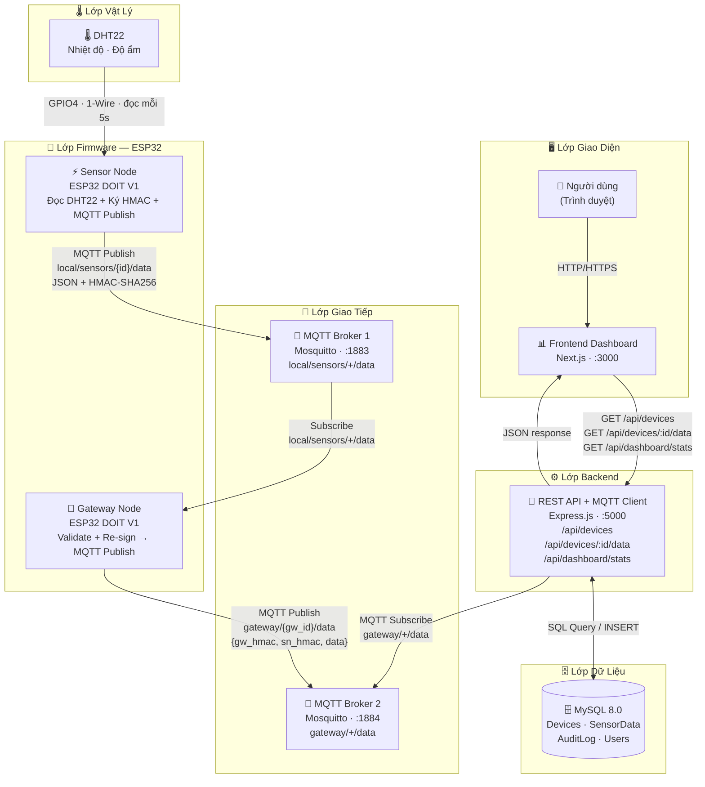

**Mô tả:** Hình này tổ chức toàn bộ hệ thống thành 6 lớp xếp từ trên xuống: **(1) Lớp Giao Diện** — người dùng tương tác với Dashboard Next.js qua trình duyệt; **(2) Lớp Backend** — REST API Express.js đóng vai trò trung tâm xử lý, vừa phục vụ frontend vừa nhận dữ liệu từ firmware; **(3) Lớp Dữ Liệu** — MySQL lưu toàn bộ thiết bị, dữ liệu cảm biến, audit log và người dùng; **(4) Lớp Giao Tiếp** — hai MQTT Broker riêng biệt phân tách mạng nội bộ (Broker 1) khỏi đường lên backend (Broker 2); **(5) Lớp Firmware** — Gateway Node và Sensor Node trên ESP32 thực hiện đọc, ký và chuyển tiếp; **(6) Lớp Vật Lý** — cảm biến DHT22 đọc nhiệt độ và độ ẩm mỗi 5 giây. Mũi tên trong hình thể hiện chiều dữ liệu và giao thức sử dụng giữa mỗi lớp.

---

### I.3 Phân Chia Trách Nhiệm

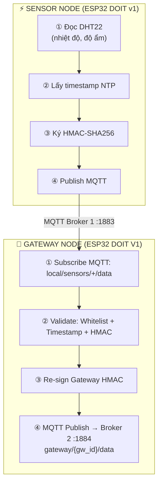

**Mô tả:** Hình này làm rõ ranh giới trách nhiệm giữa hai thiết bị firmware. **Sensor Node** thực hiện 4 bước tuần tự: đọc dữ liệu từ DHT22, lấy timestamp UTC từ NTP, ký HMAC-SHA256, rồi publish lên Broker 1. **Gateway Node** cũng thực hiện 4 bước: lắng nghe tất cả topic sensor qua wildcard, xác minh whitelist + timestamp + HMAC của sensor, ký lại bằng HMAC của gateway, rồi publish lên Broker 2. Đầu ra của Sensor Node (bước ④) kết nối trực tiếp vào đầu vào của Gateway Node (bước ①) thông qua Broker 1. Thiết kế này cho phép gateway xác minh độc lập từng sensor mà không cần tin tưởng mù quáng vào nhau.

---

## II. SENSOR NODE (ESP32 DOIT v1)

### II.1 Khởi Động — setup()

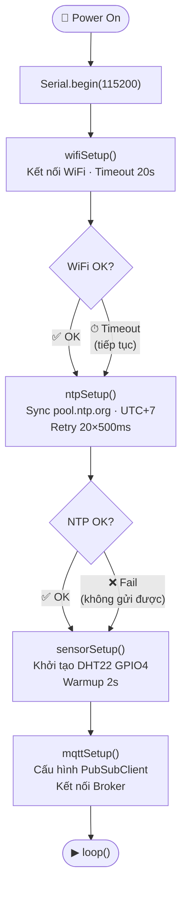

**Mô tả:** Đây là trình tự khởi động một lần của Sensor Node từ lúc cấp nguồn đến khi vào vòng lặp chính. Sau khi khởi tạo Serial, chương trình kết nối WiFi với timeout 20 giây — nếu không kết nối được vẫn tiếp tục (để tránh treo vô hạn). Tiếp theo đồng bộ NTP tối đa 20 lần thử (mỗi lần 500ms = 10 giây); nếu thất bại thì timestamp HMAC sẽ sai và backend sẽ từ chối mọi gói tin. DHT22 được khởi tạo với warmup 2 giây bắt buộc — bỏ qua delay này khiến lần đọc đầu tiên trả về NaN. Cuối cùng cấu hình PubSubClient để kết nối MQTT Broker 1 trước khi bước vào `loop()`.

### II.2 Vòng Lặp Chính — loop() · 5000ms

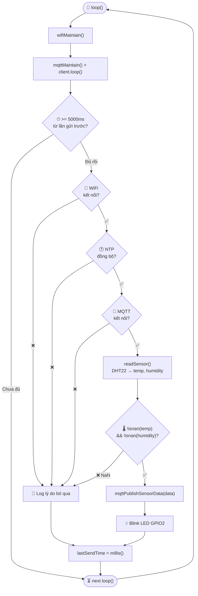

**Mô tả:** Vòng lặp chính chạy liên tục, nhưng chỉ thực sự gửi dữ liệu mỗi 5000ms. Mỗi iteration bắt đầu bằng việc duy trì kết nối WiFi và MQTT (`wifiMaintain`, `mqttMaintain`). Sau đó kiểm tra bộ đếm thời gian — nếu chưa đủ 5 giây thì bỏ qua toàn bộ phần còn lại. Khi đủ thời gian, chương trình kiểm tra 3 điều kiện theo thứ tự: WiFi có kết nối không → NTP đã đồng bộ không → MQTT có kết nối không. Chỉ khi cả 3 điều kiện thỏa mãn mới thực sự đọc DHT22 và kiểm tra thêm lần nữa xem kết quả có phải NaN không. Nếu bất kỳ bước nào thất bại thì ghi log lý do và bỏ qua chu kỳ gửi, nhưng vẫn cập nhật `lastSendTime` để không spam retry liên tục.

### II.3 Đóng Gói & Publish — mqttPublishSensorData()

**Mô tả:** Hàm này nhận một struct `SensorData` chứa nhiệt độ và độ ẩm, sau đó thực hiện 5 bước để tạo và gửi gói MQTT. Đầu tiên lấy timestamp UTC hiện tại từ NTP. Tiếp theo tạo chuỗi message theo định dạng `"DEVICE_ID:timestamp"` — định dạng này phải khớp chính xác với phía backend. Dùng mbedTLS tính HMAC-SHA256 của chuỗi đó với SECRET_KEY, cho ra 64 ký tự hex thường. Sau đó lắp tất cả vào JSON bao gồm `sensor_id`, `sn_timestamp`, `sn_hmac` và object `data`. Cuối cùng publish JSON lên topic `local/sensors/DEVICE_ID/data` qua PubSubClient, trả về `true` nếu broker xác nhận nhận thành công.

---

## III. GATEWAY NODE (ESP32 DOIT V1)

### III.1 Khởi Động — setup()

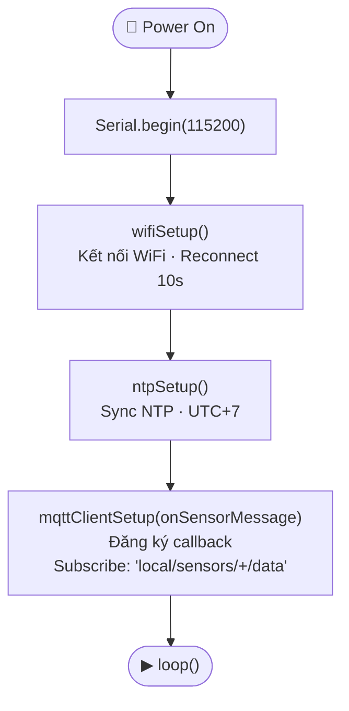

**Mô tả:** Trình tự khởi động của Gateway Node đơn giản hơn Sensor Node vì gateway không đọc cảm biến vật lý. Sau Serial và WiFi, chương trình đồng bộ NTP — đây là bước quan trọng vì gateway phải kiểm tra cửa sổ timestamp ±300 giây của các gói sensor đến. Cuối cùng `mqttClientSetup()` đồng thời đăng ký callback `onSensorMessage` và subscribe wildcard `local/sensors/+/data` trên Broker 1, sẵn sàng nhận dữ liệu từ mọi sensor node trên mạng cục bộ.

### III.2 Vòng Lặp Chính — loop() · Event-driven

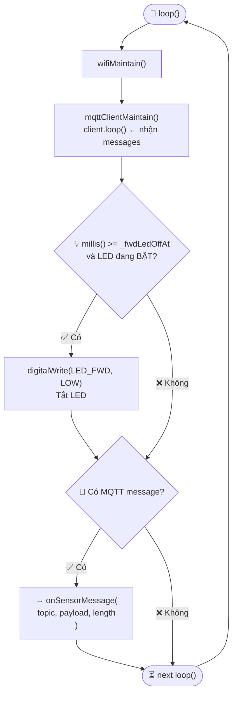

**Mô tả:** Vòng lặp Gateway là **event-driven** — không có bộ đếm thời gian cố định như Sensor Node. Phần lớn thời gian `loop()` chỉ gọi `wifiMaintain()` và `mqttClientMaintain()` (bên trong có `client.loop()` để nhận message từ broker). Logic chính duy nhất là quản lý LED chỉ thị: nếu đã đến thời điểm tắt LED (đã cài đặt 100ms sau khi forward thành công) thì tắt LED. Khi có MQTT message đến, thư viện PubSubClient tự động gọi callback `onSensorMessage()` — không cần polling thủ công.

### III.3 Xử Lý Message — onSensorMessage()

**Mô tả:** Callback này là điểm nhập duy nhất khi Broker 1 đẩy message vào gateway. Bước đầu tiên là kiểm tra NTP đã đồng bộ chưa — nếu chưa thì drop ngay lập tức vì gateway không thể kiểm tra timestamp nếu đồng hồ của mình không chính xác. Nếu NTP OK thì gọi `forwardSensorData()` để thực hiện toàn bộ pipeline xác minh 5 bước. Khi pipeline trả về `true` (forward thành công lên Broker 2), gateway bật LED_FWD và đặt timer tắt LED sau 100ms — tín hiệu thị giác nhanh cho thấy dữ liệu đang chảy qua. Nếu thất bại chỉ ghi log, không có retry tự động.

### III.4 Pipeline Validate & Forward — forwardSensorData()

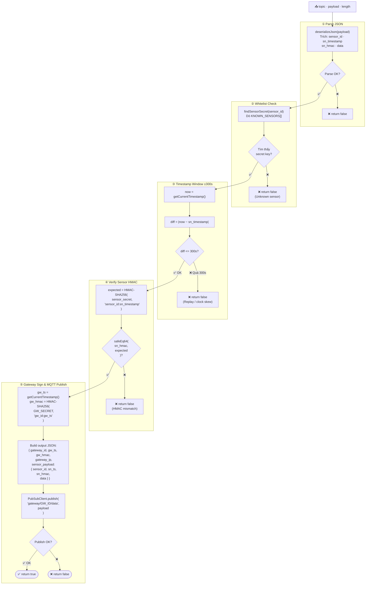

**Mô tả:** Đây là pipeline 5 bước xác minh tuần tự — mỗi bước thất bại sẽ return false ngay, không tiếp tục. **Bước ①** parse JSON payload, kiểm tra đủ 4 trường bắt buộc (`sensor_id`, `sn_timestamp`, `sn_hmac`, `data`). **Bước ②** tra cứu secret key của sensor trong registry động (fetch từ backend mỗi 5 phút) hoặc danh sách cứng `KNOWN_SENSORS[]` trong config — nếu sensor không có trong danh sách thì từ chối. **Bước ③** kiểm tra cửa sổ thời gian: hiệu số giữa đồng hồ gateway hiện tại và `sn_timestamp` phải trong khoảng ±300 giây, chống replay attack. **Bước ④** tính lại HMAC từ secret key và chuỗi `"sensor_id:sn_timestamp"`, so sánh constant-time với `sn_hmac` trong gói tin. **Bước ⑤** nếu tất cả hợp lệ: lấy timestamp gateway mới, ký HMAC gateway, ghép toàn bộ vào JSON đầu ra (bao gồm cả `sn_hmac` gốc để backend xác minh lại lần thứ hai), rồi publish lên Broker 2.

---

## IV. DÙNG CHUNG — CẢ HAI NODE

### IV.1 HMAC-SHA256 — computeHMAC() (mbedTLS)

> Dùng ở cả **Sensor Node** (ký dữ liệu) và **Gateway Node** (verify + re-sign)

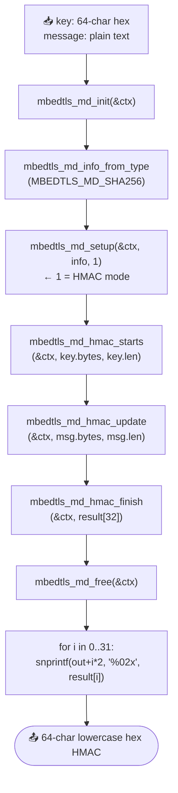

**Mô tả:** Hàm này ánh xạ trực tiếp vào 6 lời gọi API của mbedTLS. Đầu tiên khởi tạo context và lấy thông tin thuật toán SHA256. `mbedtls_md_setup` với tham số `1` bật chế độ HMAC (tham số `0` là chế độ hash thông thường — đây là chi tiết dễ nhầm). Ba lời gọi tiếp theo nạp key, nạp message, rồi hoàn tất tính toán vào buffer 32 bytes. Sau đó giải phóng context (quan trọng để tránh memory leak trên thiết bị nhúng). Cuối cùng dùng `snprintf` với format `%02x` để chuyển 32 bytes thành 64 ký tự hex thường — cách encode này khớp chính xác với `.toString("hex")` của Node.js trên backend.

### IV.2 Constant-Time Compare — safeEq64()

> Chỉ dùng ở **Gateway Node** (bước xác minh HMAC)

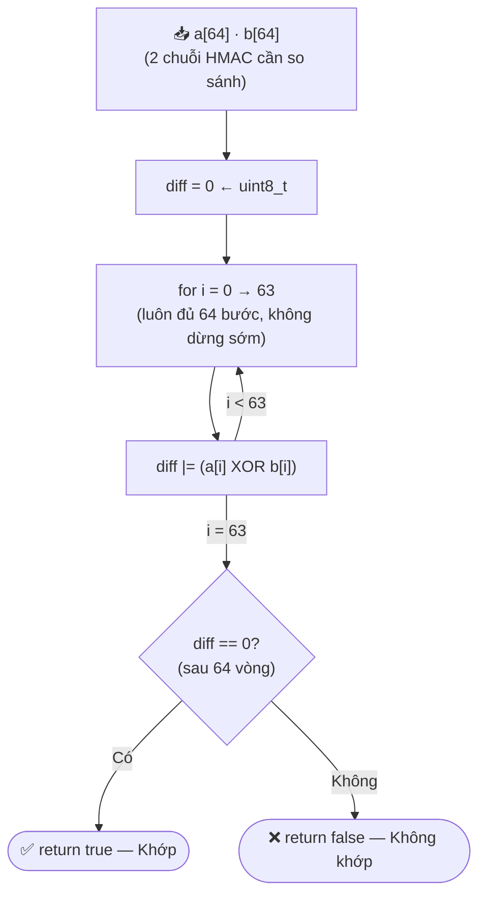

**Mô tả:** Hàm so sánh hai chuỗi HMAC 64 ký tự theo cách **không để lộ thông tin về vị trí ký tự khác nhau**. Khởi tạo biến `diff = 0`, sau đó XOR từng cặp ký tự `a[i]` và `b[i]` rồi OR vào `diff` — vòng lặp **luôn chạy đủ 64 bước** dù hai chuỗi đã khác nhau từ bước đầu. Sau 64 bước nếu `diff == 0` thì hai chuỗi khớp nhau hoàn toàn. Nếu dùng `strcmp()` thay thế, hàm sẽ trả về ngay khi gặp ký tự đầu tiên khác — kẻ tấn công có thể gửi hàng nghìn HMAC giả và đo thời gian phản hồi để suy ra từng ký tự đúng (Timing Attack).

> ⚠️ **Lý do:** `strcmp()` dừng ở byte đầu tiên khác nhau — kẻ tấn công đo thời gian để đoán từng ký tự HMAC (Timing Attack). `safeEq64()` luôn chạy đúng 64 iteration.

### IV.3 WiFi Auto-Reconnect — wifiMaintain()

> Gọi mỗi `loop()` ở **cả hai node**. Gateway dùng interval 10s, Sensor Node reconnect ngay.

**Mô tả:** Hàm này được gọi mỗi `loop()` để giữ kết nối WiFi liên tục mà không block. Nếu `WiFi.status() == WL_CONNECTED` thì cập nhật cờ `_connected = true` và thoát ngay — đây là trường hợp phổ biến nhất, overhead tối thiểu. Khi mất kết nối, hàm kiểm tra xem trước đó có đang kết nối không: nếu có (vừa mất) thì ghi log "WiFi disconnected" rồi thử reconnect; nếu cờ đã là false (đang trong quá trình retry) thì bỏ qua log và tiếp tục retry. Gateway dùng interval 10 giây giữa các lần retry, Sensor Node reconnect ngay lập tức.

### IV.4 Đồng Bộ NTP — ntpSetup()

> Gọi một lần trong `setup()` ở **cả hai node**. NTP là tiền điều kiện để HMAC timestamp hợp lệ.

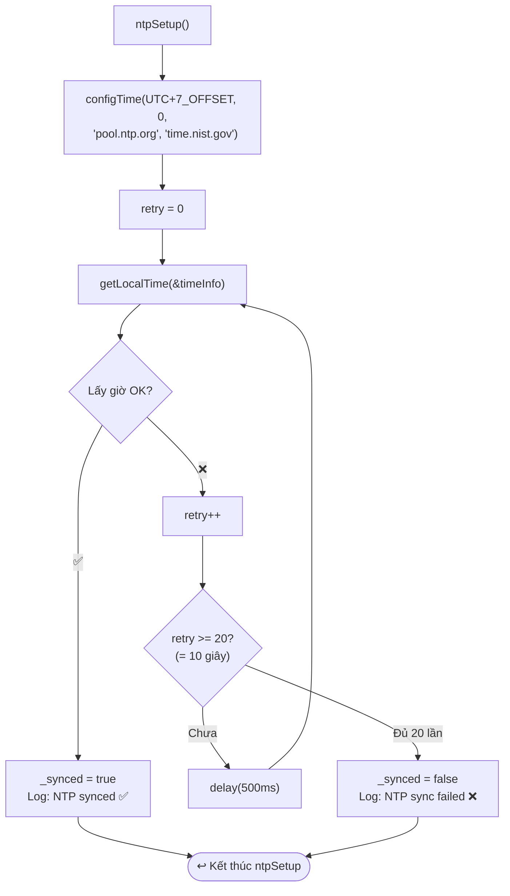

**Mô tả:** `ntpSetup()` chạy một lần duy nhất trong `setup()`. Sau khi gọi `configTime()` để cấu hình timezone UTC+7 và chỉ định hai NTP server dự phòng, chương trình thử lấy giờ qua `getLocalTime()` tối đa 20 lần với delay 500ms mỗi lần (tổng 10 giây). Nếu thành công, đặt cờ `_synced = true` — các hàm khác kiểm tra cờ này trước khi dùng timestamp. Nếu thất bại sau 20 lần, đặt `_synced = false` và tiếp tục chương trình nhưng HMAC của mọi gói tin sẽ bị backend từ chối do timestamp sai. Đây là lý do NTP là tiền điều kiện cứng cho toàn bộ hệ thống bảo mật.

---

## V. END-TO-END — Luồng Hoàn Chỉnh

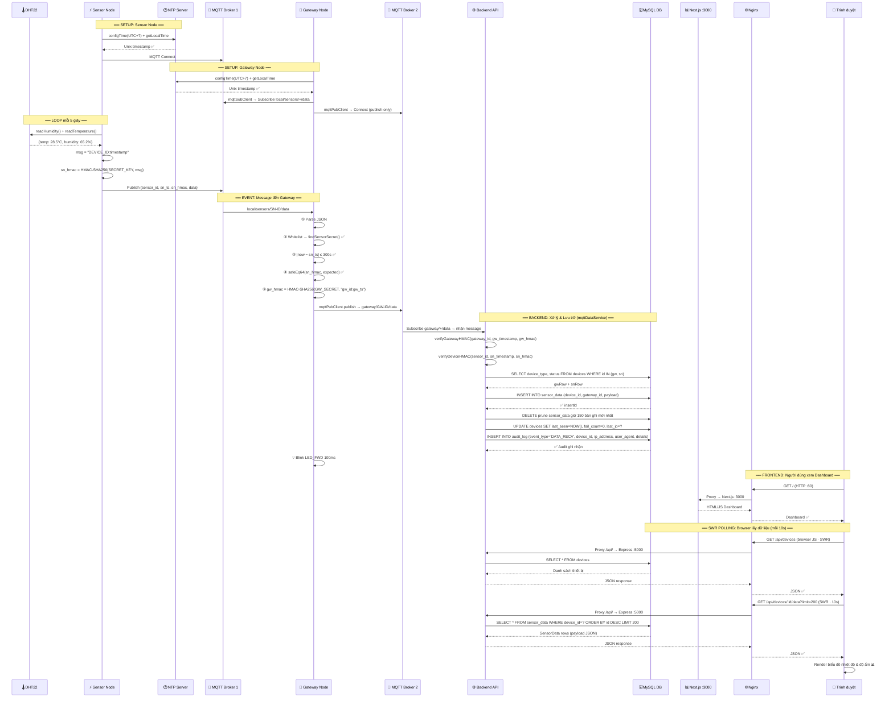

**Mô tả:** Đây là sơ đồ trình tự đầy đủ nhất, thể hiện toàn bộ vòng đời của một bản đọc cảm biến từ phần cứng đến màn hình người dùng. Có thể đọc theo 5 giai đoạn:

- **Setup Sensor Node:** Đồng bộ NTP lấy Unix timestamp, kết nối MQTT Broker 1. Đây là điều kiện tiên quyết để HMAC có giá trị thời gian hợp lệ.
- **Setup Gateway Node:** Tương tự đồng bộ NTP riêng. Sau đó subscribe Broker 1 (lắng nghe sensor) và connect Broker 2 (chuẩn bị publish lên backend).
- **Loop mỗi 5 giây:** Sensor Node đọc DHT22, tạo chuỗi `"DEVICE_ID:timestamp"`, tính HMAC, đóng gói JSON và publish lên Broker 1.
- **Event xử lý tại Gateway:** Broker 1 đẩy message vào Gateway. Gateway thực hiện 5 bước xác minh, sau đó ký HMAC gateway và publish gói kép (chứa cả `sn_hmac` và `gw_hmac`) lên Broker 2.
- **Backend lưu trữ:** API nhận từ Broker 2, xác minh lại cả hai HMAC độc lập, truy vấn DB kiểm tra trạng thái thiết bị, insert dữ liệu sensor, prune giới hạn 150 bản ghi, cập nhật `last_seen` và ghi audit log.
- **Frontend polling:** Trình duyệt dùng SWR poll mỗi 10 giây, request đi qua Nginx proxy đến Express API, lấy danh sách thiết bị và dữ liệu cảm biến, render biểu đồ nhiệt độ và độ ẩm thời gian thực.

---

## VI. BẢO MẬT — Tổng Hợp

| Cơ Chế | Node Áp Dụng | Mô Tả | Chống |
|---------|-------------|--------|-------|
| **HMAC-SHA256** | Cả hai | Ký/xác minh payload với secret key 256-bit | Giả mạo dữ liệu |
| **Timestamp Window ±300s** | Gateway | Từ chối message cũ hơn 5 phút | Replay Attack |
| **Constant-Time Compare** | Gateway | `safeEq64()` — không dừng sớm | Timing Attack |
| **Sensor Whitelist** | Gateway | `KNOWN_SENSORS[]` cục bộ + dynamic fetch từ `/api/device/sensors` mỗi 5 phút | Thiết bị giả mạo |
| **Dual Signature** | Gateway | Gửi cả sn_hmac + gw_hmac lên backend | Giả mạo gateway |
| **Unique Keys** | Cả hai | Mỗi thiết bị có secret key riêng từ server | Blast radius khi lộ key |
