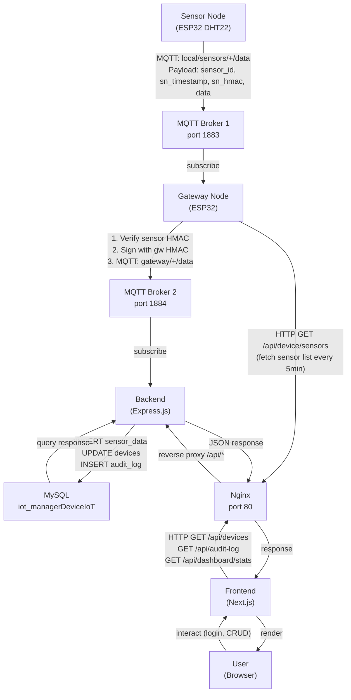
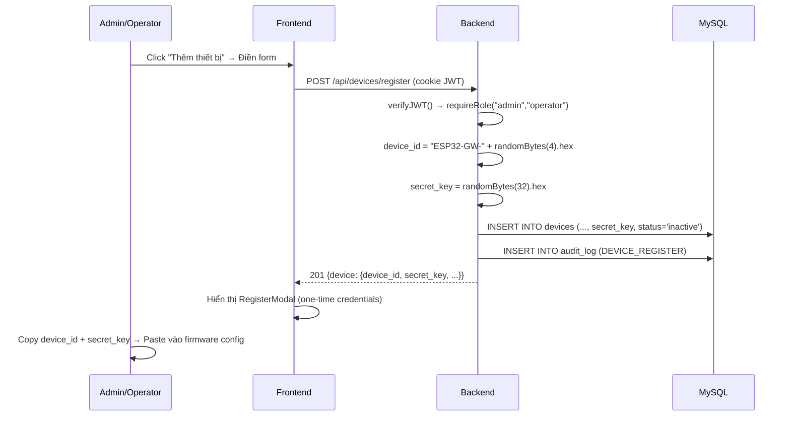
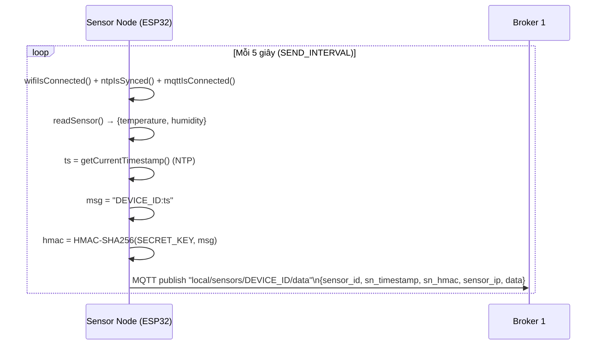
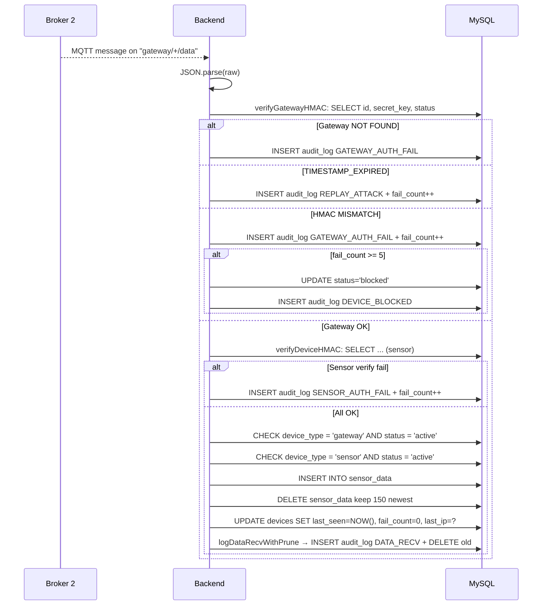
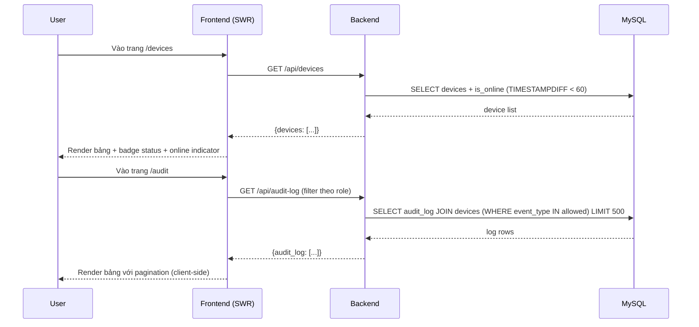
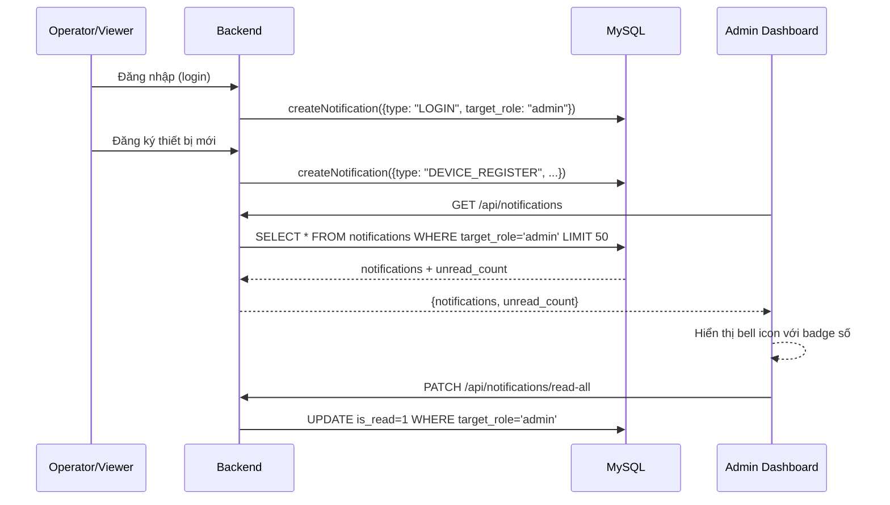
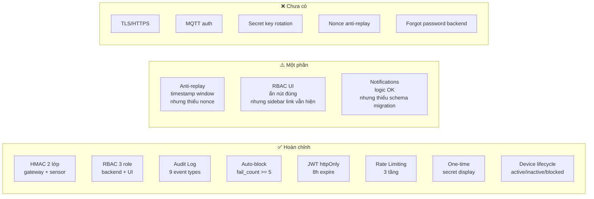

# Phân Tích Kiến Trúc Hệ Thống IoT Manager RBAC

> Được tổng hợp từ toàn bộ mã nguồn trong workspace `e:/WorkSpace/managerDeviceIoT-RBAC`  
> Ngày: 2026-06-21

---

## Mục Lục

1. [Tổng quan hệ thống](#1-tổng-quan-hệ-thống)
2. [Flow tạo Device ID và Secret Key](#2-flow-tạo-device-id-và-secret-key)
3. [Flow xác thực thiết bị / Verify](#3-flow-xác-thực-thiết-bị--verify)
4. [Database](#4-database)
5. [Backend](#5-backend)
6. [MQTT](#6-mqtt)
7. [Frontend](#7-frontend)
8. [Flow các service](#8-flow-các-service)
9. [Phân quyền hiện tại (RBAC)](#9-phân-quyền-hiện-tại-rbac)
10. [Đánh giá bảo mật hiện tại](#10-đánh-giá-bảo-mật-hiện-tại)
11. [Kết luận](#11-kết-luận)

---

## 1. Tổng Quan Hệ Thống

### 1.1 Các service/container đang có

| Container         | Image               | Port host→container | Vai trò                            |
|-------------------|---------------------|----------------------|------------------------------------|
| `iot-mysql`       | `mysql:8.0`         | 3308 → 3306          | Database quan hệ (MySQL)           |
| `iot-mosquitto-1` | `eclipse-mosquitto:2` | 1883 → 1883        | MQTT Broker 1: Sensor → Gateway    |
| `iot-mosquitto-2` | `eclipse-mosquitto:2` | 1884 → 1883        | MQTT Broker 2: Gateway → Backend   |
| `iot-nginx`       | `nginx:alpine`      | 80 → 80              | Reverse proxy điều phối traffic    |
| `iot-backend`     | Custom (Node.js)    | 5000 → 5000          | REST API + MQTT subscriber         |
| `iot-frontend`    | Custom (Next.js)    | 3000 → 3000          | Dashboard UI                       |

### 1.2 Firmware (ngoài Docker)

| Firmware          | Platform | Board             | Vai trò                                    |
|-------------------|----------|-------------------|--------------------------------------------|
| `sensor-node`     | ESP32    | DOIT DevKit v1    | Cảm biến DHT22, publish lên Broker 1       |
| `sensor-node-2`   | ESP32    | DOIT DevKit v1    | Cảm biến thứ 2 (cùng kiến trúc sensor-node) |
| `gateway-node`    | ESP32    | DOIT DevKit v1    | Bridge Broker 1 → Broker 2, verify HMAC   |

### 1.3 Luồng tổng thể

```
Sensor Node (ESP32)
    │ MQTT publish "local/sensors/<sensor_id>/data"
    │ Broker 1 (port 1883)
    ↓
Gateway Node (ESP32)
    │ Verify sensor HMAC-SHA256 + timestamp window
    │ MQTT publish "gateway/<gw_id>/data"
    │ Broker 2 (port 1884)
    ↓
Backend (Express.js)
    │ Subscribe "gateway/+/data" tại Broker 2
    │  HOẶC
    │ HTTP POST /api/device/data (qua Nginx port 80)
    │ Verify gateway HMAC + sensor HMAC (2 lớp)
    │ Kiểm tra device_type, status active
    ↓
MySQL Database
    │ INSERT sensor_data, UPDATE last_seen, INSERT audit_log
    ↓
Frontend (Next.js) Dashboard
    │ Polling SWR / HTTP GET /api/devices/:id/data
    ↓
User (Browser)
```

---

## 2. Flow Tạo Device ID và Secret Key

### 2.1 Device ID được tạo ở đâu

**File:** `backend/src/routes/devices.ts` – route `POST /api/devices/register`

```
suffix    = crypto.randomBytes(4).toString("hex").toUpperCase()   // 8 ký tự hex
typeTag   = "SN" (sensor) | "GW" (gateway)
device_id = "ESP32-{typeTag}-{suffix}"
```

Ví dụ thực tế: `ESP32-GW-78867B14`, `ESP32-SN-CBF05770`

### 2.2 Secret key được tạo ở đâu

Cùng file, cùng route:

```
secret_key = crypto.randomBytes(32).toString("hex")   // 64 ký tự hex (256-bit)
```

### 2.3 Backend lưu key như thế nào trong database

- Lưu **PLAINTEXT** vào cột `secret_key VARCHAR(64)` trong bảng `devices`
- **Không hash**, **không mã hóa** — vì backend cần dùng secret_key nguyên để tính/verify HMAC-SHA256

```sql
INSERT INTO devices (device_id, device_name, device_type, secret_key, status, location, fail_count, created_by)
VALUES (?, ?, ?, ?, 'inactive', ?, 0, ?)
```

### 2.4 Key được hiển thị/trả về frontend như thế nào

- Trả về **đúng một lần** ngay trong response của `POST /api/devices/register`
- Sau đó **không bao giờ** trả `secret_key` trong bất kỳ GET nào (cột bị loại khỏi SELECT)
- Comment trong code: `// Return credentials exactly once – secret_key is never returned again`

```json
{
  "success": true,
  "device": {
    "id": 3,
    "device_id": "ESP32-GW-78867B14",
    "device_name": "...",
    "device_type": "gateway",
    "location": null,
    "status": "inactive",
    "secret_key": "d46abb32f2fa488f35e07377cf0d147c..."
  }
}
```

Frontend hiển thị qua modal `RegisterModal` — user phải sao chép thủ công và điền vào firmware (`config_gw.h` / `config_1.h`).

### 2.5 Sensor/Gateway nhận và dùng key như thế nào

- User điền `device_id` và `secret_key` vào file config firmware cứng (hardcode):
  - `firmware/gateway-node/include/config_gw.h` — `GW_DEVICE_ID`, `GW_SECRET_KEY`
  - `firmware/sensor-node/include/config_1.h` — `DEVICE_ID`, `SECRET_KEY`
- Key được dùng để tính HMAC-SHA256: `HMAC-SHA256(secret_key, "{device_id}:{timestamp}")`

### 2.6 Có one-time secret hay không

**Có**: `secret_key` được trả về **đúng một lần** khi đăng ký. Không có cơ chế tạo lại (rotate) key trong code hiện tại.

### 2.7 Có hash/encrypt secret trong DB hay đang lưu plaintext

**Lưu plaintext** — đây là thiết kế bắt buộc vì HMAC-SHA256 cần biết key gốc để verify. Không thể hash theo kiểu bcrypt như password.

---

## 3. Flow Xác Thực Thiết Bị / Verify

### 3.1 Cấu trúc payload Gateway gửi lên Backend

**Qua MQTT topic `gateway/<gw_id>/data`** hoặc **HTTP POST `/api/device/data`**:

```json
{
  "gateway_id": "ESP32-GW-78867B14",
  "gateway_ip": "192.168.100.54",
  "gw_timestamp": 1750000000,
  "gw_hmac": "a3f1b2c4...(64 hex chars)",
  "sensor_payload": {
    "sensor_id": "ESP32-SN-CBF05770",
    "sensor_ip": "192.168.100.55",
    "sn_timestamp": 1750000000,
    "sn_hmac": "d8e4f5a1...(64 hex chars)",
    "data": {
      "temperature": 28.5,
      "humidity": 65.2
    }
  }
}
```

Sensor Node publish **payload nội bộ** lên Broker 1 (`local/sensors/<sensor_id>/data`):

```json
{
  "sensor_id": "ESP32-SN-CBF05770",
  "sn_timestamp": 1750000000,
  "sn_hmac": "d8e4f5a1...",
  "sensor_ip": "192.168.100.55",
  "data": {
    "temperature": 28.5,
    "humidity": 65.2
  }
}
```

### 3.2 Backend kiểm tra thiết bị hợp lệ như thế nào

**File:** `backend/src/middleware/validateDevice.ts` + `backend/src/services/hmacService.ts`

**Công thức HMAC:**
```
message  = "{device_id}:{timestamp}"
expected = HMAC-SHA256(secret_key, message)   → hex string
```

**Cửa sổ timestamp:** ±300 giây (5 phút)

### 3.3 Chi tiết các bước verify (từ code thực)

```
Bước 1: Kiểm tra trường bắt buộc của Gateway
  → Thiếu gateway_id / gw_timestamp / gw_hmac → 400 MISSING_GATEWAY_FIELDS

Bước 2: Gateway HMAC Verify (Level 1)
  a. Tìm gateway trong DB: SELECT id, secret_key, status, fail_count
     → Không tìm thấy → 401 NOT_FOUND
  b. Kiểm tra timestamp: |now - gw_timestamp| <= 300s
     → Quá hạn → log "REPLAY_ATTACK" → 401 TIMESTAMP_EXPIRED
  c. Tính expected = HMAC-SHA256(secret_key, "gw_id:gw_timestamp")
     → Dùng crypto.timingSafeEqual() để so sánh
     → Sai → log "GATEWAY_AUTH_FAIL" → tăng fail_count
     → fail_count >= 5 → tự động block device + log "DEVICE_BLOCKED"
     → 401 HMAC_MISMATCH

Bước 3: Kiểm tra trường bắt buộc của Sensor
  → Thiếu sensor_payload, sensor_id, sn_timestamp, sn_hmac → 400 MISSING_SENSOR_FIELDS

Bước 4: Sensor HMAC Verify (Level 2)
  → Tương tự bước 2 nhưng cho sensor
  → Sai → log "SENSOR_AUTH_FAIL" → 401 SENSOR_AUTH_FAIL

Bước 5: Kiểm tra device_type (trong HTTP route)
  → Gateway không phải type "gateway" → log "PRIVILEGE_ESCALATION" → 403
  → Sensor không phải type "sensor"   → log "PRIVILEGE_ESCALATION" → 403

Bước 6: Kiểm tra status (cả gateway và sensor phải là "active")
  → "blocked"   → 403 DEVICE_BLOCKED
  → "inactive"  → 403 DEVICE_NOT_ACTIVE
```

**Lưu ý:** MQTT path (mqttDataService.ts) thực hiện các bước tương tự nhưng không gọi middleware, tự xử lý trực tiếp.

### 3.4 Khi verify thành công

- Attach `req.gateway` và `req.sensor` (object) vào request
- `INSERT INTO sensor_data (device_id, gateway_id, payload)` — lưu JSON data
- Giữ tối đa 150 bản ghi/sensor (DELETE cũ hơn)
- `UPDATE devices SET last_seen = NOW(), fail_count = 0, last_ip = ?`
- `logDataRecvWithPrune()` — ghi audit log DATA_RECV, giữ tối đa 150 log/device

### 3.5 Khi verify thất bại

| Lỗi                | HTTP Status | Audit Event        | Hành động tự động         |
|--------------------|-------------|--------------------|---------------------------|
| Không tìm thấy     | 401         | GATEWAY/SENSOR_AUTH_FAIL | —                   |
| Timestamp hết hạn  | 401         | REPLAY_ATTACK      | fail_count++, có thể block |
| HMAC sai           | 401         | GATEWAY/SENSOR_AUTH_FAIL | fail_count++, block khi ≥5 |
| Sai device_type    | 403         | PRIVILEGE_ESCALATION | —                        |
| Device bị khóa     | 403         | —                  | —                         |
| Device inactive    | 403         | —                  | —                         |

---

## 4. Database

### 4.1 Database đang dùng

**MySQL 8.0** — charset `utf8mb4`, collation `utf8mb4_unicode_ci`  
Database name: `iot_managerDeviceIoT`  
Connection pool: `mysql2` (Node.js)

### 4.2 Các bảng chính

**File schema:** `database/migrations/001_schema.sql`

#### Bảng `users`

| Cột            | Kiểu                              | Ghi chú                     |
|----------------|-----------------------------------|-----------------------------|
| `id`           | INT UNSIGNED AUTO_INCREMENT       | PK                          |
| `username`     | VARCHAR(64) NOT NULL UNIQUE       | Tên đăng nhập               |
| `password_hash`| VARCHAR(255) NOT NULL             | bcrypt cost=12              |
| `role`         | ENUM('admin','operator','viewer') | Phân quyền                  |
| `created_at`   | DATETIME DEFAULT CURRENT_TIMESTAMP|                             |
| `last_login`   | DATETIME NULL                     | Cập nhật mỗi lần login      |

#### Bảng `devices`

| Cột            | Kiểu                                       | Ghi chú                              |
|----------------|--------------------------------------------|--------------------------------------|
| `id`           | INT UNSIGNED AUTO_INCREMENT                | PK                                   |
| `device_id`    | VARCHAR(64) NOT NULL UNIQUE                | VD: `ESP32-GW-78867B14`             |
| `device_name`  | VARCHAR(128) NOT NULL                      | Tên hiển thị                         |
| `device_type`  | ENUM('sensor','gateway') NOT NULL          |                                      |
| `secret_key`   | VARCHAR(64) NOT NULL                       | **Plaintext** 256-bit hex            |
| `status`       | ENUM('inactive','active','blocked')        | Mặc định 'inactive'                  |
| `location`     | VARCHAR(255) NULL                          | Tùy chọn                             |
| `fail_count`   | TINYINT UNSIGNED DEFAULT 0                 | Đếm lần xác thực thất bại            |
| `last_seen`    | DATETIME NULL                              | Cập nhật mỗi lần nhận dữ liệu       |
| `last_ip`      | VARCHAR(45) NULL                           | IP lần cuối kết nối                  |
| `created_at`   | DATETIME DEFAULT CURRENT_TIMESTAMP         |                                      |
| `created_by`   | INT UNSIGNED NULL → FK `users.id`          | Người đăng ký                        |

#### Bảng `sensor_data`

| Cột            | Kiểu                   | Ghi chú                              |
|----------------|------------------------|--------------------------------------|
| `id`           | BIGINT UNSIGNED PK     | Auto increment                       |
| `device_id`    | INT UNSIGNED → FK devices.id | Sensor đã verified             |
| `gateway_id`   | INT UNSIGNED → FK devices.id | Gateway đã verified            |
| `payload`      | JSON NOT NULL          | Dữ liệu cảm biến (temperature, humidity,...) |
| `received_at`  | DATETIME DEFAULT NOW() | Thời điểm backend nhận               |

Index: `(device_id, received_at DESC)` — phục vụ query lịch sử theo sensor  
**Giới hạn:** Tự động xóa, giữ chỉ **150 bản ghi mới nhất** mỗi sensor

#### Bảng `device_tokens`

| Cột            | Kiểu                   | Ghi chú                              |
|----------------|------------------------|--------------------------------------|
| `id`           | BIGINT UNSIGNED PK     |                                      |
| `device_id`    | INT UNSIGNED → FK      |                                      |
| `token_hash`   | VARCHAR(255) NOT NULL  |                                      |
| `expires_at`   | DATETIME NOT NULL      |                                      |
| `revoked`      | TINYINT(1) DEFAULT 0   |                                      |

> **Lưu ý:** Bảng này tồn tại trong schema nhưng **chưa được sử dụng** trong bất kỳ route hay service nào của backend hiện tại.

#### Bảng `audit_log`

| Cột            | Kiểu                   | Ghi chú                              |
|----------------|------------------------|--------------------------------------|
| `id`           | BIGINT UNSIGNED PK     |                                      |
| `event_type`   | VARCHAR(64) NOT NULL   | Xem danh sách bên dưới              |
| `device_id`    | INT UNSIGNED NULL → FK |                                      |
| `ip_address`   | VARCHAR(45) NULL       |                                      |
| `user_agent`   | VARCHAR(512) NULL      |                                      |
| `details`      | JSON NULL              | Chi tiết sự kiện                     |
| `created_at`   | DATETIME DEFAULT NOW() |                                      |

Index: `(event_type, created_at DESC)`  
**Giới hạn `DATA_RECV`:** Tự động xóa, giữ chỉ **150 log mới nhất** mỗi device (dùng transaction)

#### Bảng `notifications` ⚠️

> **Chưa tìm thấy trong `001_schema.sql`**. Backend có `notificationService.ts` INSERT vào bảng này và route `/api/notifications` đọc từ nó. Bảng này được tạo thủ công hoặc qua migration chưa được đưa vào `database/migrations/`. Các cột suy luận từ code:

| Cột               | Vai trò                        |
|-------------------|--------------------------------|
| `id`              | PK                             |
| `title`           | Tiêu đề thông báo              |
| `message`         | Nội dung                       |
| `type`            | Loại: LOGIN, DEVICE_REGISTER, DEVICE_BLOCKED, DEVICE_UNBLOCKED, DEVICE_STATUS_CHANGE |
| `actor_id`        | User id thực hiện              |
| `actor_username`  | Tên user                       |
| `actor_role`      | Role của user                  |
| `target_role`     | Role nhận thông báo (= 'admin')|
| `related_device_id` | FK devices.id              |
| `is_read`         | 0/1                            |
| `created_at`      | DATETIME                       |

### 4.3 Quan hệ giữa các bảng

```
users (1) ←────────────── devices (N)  [created_by]
devices (1) ←──────────── sensor_data (N)  [device_id, gateway_id]
devices (1) ←──────────── device_tokens (N)
devices (0/1) ←────────── audit_log (N)  [device_id, nullable]
```

### 4.4 Các event_type trong audit_log

| Event Type            | Khi nào phát sinh                          |
|-----------------------|--------------------------------------------|
| `GATEWAY_AUTH_FAIL`   | HMAC gateway sai                           |
| `SENSOR_AUTH_FAIL`    | HMAC sensor sai                            |
| `REPLAY_ATTACK`       | Timestamp vượt cửa sổ ±300s               |
| `PRIVILEGE_ESCALATION`| Device đăng ký sai type (sensor dùng gw ID) |
| `DATA_RECV`           | Nhận và lưu dữ liệu thành công            |
| `DEVICE_REGISTER`     | Admin/operator đăng ký device mới          |
| `DEVICE_BLOCKED`      | Device bị block tự động (fail_count ≥ 5)  |
| `DEVICE_STATUS_CHANGE`| Admin/operator đổi status thủ công        |
| `DEVICE_DELETE`       | Admin xóa device                           |

---

## 5. Backend

### 5.1 Framework đang dùng

**Express.js 5.x** + **TypeScript 6.x**  
Runtime: Node.js  
Dev: `ts-node-dev`  
Prod: tsc build → `node dist/server.js`

### 5.2 Cấu trúc thư mục backend

```
backend/src/
├── app.ts                    # Express app, middleware toàn cục, rate limiter
├── server.ts                 # Entry point – khởi động HTTP + MQTT services
├── config/
│   ├── db.ts                 # MySQL connection pool (mysql2)
│   ├── env.ts                # Đọc biến môi trường
│   └── migrate.ts            # Chạy migration SQL khi start
├── middleware/
│   ├── verifyJWT.ts          # Đọc JWT từ httpOnly cookie
│   ├── rbac.ts               # requireRole(...roles) factory
│   └── validateDevice.ts     # 2-level HMAC verify cho HTTP /api/device/data
├── routes/
│   ├── index.ts              # Mount tất cả router
│   ├── auth.ts               # /api/auth/login|logout|me
│   ├── devices.ts            # /api/devices (CRUD + status)
│   ├── data.routes.ts        # POST /api/device/data (HTTP path)
│   ├── sensors.routes.ts     # GET /api/device/sensors (gateway fetch sensor list)
│   ├── audit.ts              # GET/DELETE /api/audit-log
│   ├── dashboard.ts          # GET /api/dashboard/stats
│   ├── users.ts              # /api/users (admin only)
│   ├── notifications.ts      # /api/notifications (admin only)
│   └── health.routes.ts      # GET /api/health
└── services/
    ├── auditLogger.ts         # log() và logDataRecvWithPrune()
    ├── hmacService.ts         # verifyGatewayHMAC(), verifyDeviceHMAC()
    ├── mqttDataService.ts     # Subscribe broker2, verify + save data
    ├── mqttTracker.ts         # Subscribe $SYS logs để lấy IP thiết bị
    ├── notificationService.ts # createNotification() cho admin
    └── deviceStatus.ts        # (chưa kiểm tra chi tiết)
```

### 5.3 Các API endpoint chính

| Method   | Path                              | Auth         | RBAC               | Mô tả                          |
|----------|-----------------------------------|--------------|--------------------|--------------------------------|
| POST     | `/api/auth/login`                 | —            | —                  | Đăng nhập, set JWT cookie      |
| POST     | `/api/auth/logout`                | —            | —                  | Xóa cookie                     |
| GET      | `/api/auth/me`                    | JWT          | any                | Trả thông tin user hiện tại    |
| GET      | `/api/health`                     | —            | —                  | Health check                   |
| GET      | `/api/devices`                    | JWT          | any                | Danh sách thiết bị             |
| POST     | `/api/devices/register`           | JWT          | admin, operator    | Đăng ký thiết bị mới           |
| GET      | `/api/devices/:id`                | JWT          | any                | Chi tiết + 10 bản ghi gần nhất |
| GET      | `/api/devices/:id/data`           | JWT          | any                | Lịch sử dữ liệu (pagination)  |
| PATCH    | `/api/devices/:id/status`         | JWT          | admin, operator    | Đổi status                     |
| DELETE   | `/api/devices/:id`                | JWT          | admin              | Xóa device + cascade           |
| POST     | `/api/device/data`                | HMAC         | —                  | Nhận dữ liệu từ Gateway (HTTP) |
| GET      | `/api/device/sensors`             | HMAC (GW)    | —                  | Gateway lấy danh sách sensor   |
| GET      | `/api/audit-log`                  | JWT          | theo role          | Xem audit log                  |
| DELETE   | `/api/audit-log/bulk`             | JWT          | admin              | Xóa nhiều log theo ID          |
| DELETE   | `/api/audit-log/by-type`          | JWT          | admin              | Xóa toàn bộ log theo loại      |
| DELETE   | `/api/audit-log/data-recv`        | JWT          | admin              | Alias xóa DATA_RECV            |
| GET      | `/api/dashboard/stats`            | JWT          | any                | Stats tổng quan                |
| GET      | `/api/users`                      | JWT          | admin              | Danh sách user                 |
| POST     | `/api/users`                      | JWT          | admin              | Tạo user mới (operator/viewer) |
| PATCH    | `/api/users/:id/password`         | JWT          | admin              | Đổi mật khẩu user             |
| DELETE   | `/api/users/:id`                  | JWT          | admin              | Xóa user (không tự xóa mình)  |
| GET      | `/api/notifications`              | JWT          | admin              | Danh sách notification         |
| PATCH    | `/api/notifications/:id/read`     | JWT          | admin              | Đánh dấu đã đọc               |
| PATCH    | `/api/notifications/read-all`     | JWT          | admin              | Đánh dấu tất cả đã đọc       |

### 5.4 Middleware xác thực JWT

**File:** `backend/src/middleware/verifyJWT.ts`

- Đọc token từ **httpOnly cookie** tên `token` (không dùng Authorization header)
- Verify bằng `jwt.verify(token, process.env.JWT_SECRET!)`
- Payload: `{ id, username, role }`
- Lỗi: 401 `NO_TOKEN` hoặc 401 `INVALID_TOKEN`
- JWT expire: **8 giờ**

### 5.5 Middleware phân quyền RBAC

**File:** `backend/src/middleware/rbac.ts`

```typescript
export function requireRole(...roles: string[]) {
  return (req, res, next) => {
    const user = req.user;
    if (!user || !roles.includes(user.role)) {
      res.status(403).json({ error: "FORBIDDEN" });
      return;
    }
    next();
  };
}
```

### 5.6 Cách backend xử lý lỗi 401/403

- **401**: Không có token hoặc token không hợp lệ → `{ error: "NO_TOKEN" | "INVALID_TOKEN" }`
- **403**: Không đủ quyền → `{ error: "FORBIDDEN" }` hoặc `{ error: "DEVICE_BLOCKED" | "DEVICE_NOT_ACTIVE" }`
- Global error handler: trả `{ status: "error", message: "..." }` với status code tương ứng

### 5.7 Cách backend ghi audit log

Hàm `log(event_type, device_id, ip, user_agent, details)` trong `auditLogger.ts`:
- INSERT vào `audit_log`
- **Không bao giờ throw** — lỗi ghi log không ảnh hưởng luồng chính
- `logDataRecvWithPrune()` dùng transaction để INSERT + DELETE cũ (giữ 150)

### 5.8 Rate Limiting

| Endpoint                | Giới hạn               |
|-------------------------|------------------------|
| `/api/auth/login`       | 10 req / 15 phút / IP  |
| `/api/device/data`      | 60 req / 1 phút / IP   |
| Tất cả `/api/*` khác   | 100 req / 15 phút / IP |

### 5.9 Bảo mật HTTP

- **Helmet.js**: XSS headers, clickjacking prevention, MIME sniffing
- **CORS**: Chỉ cho phép `FRONTEND_URL` (mặc định http://localhost:3000)
- **JSON body limit**: 10kb để chống DoS
- **Morgan**: HTTP access logging

---

## 6. MQTT

### 6.1 Cấu hình hai broker

| Broker   | Container         | Port host | Topic                        | Mục đích                    |
|----------|-------------------|-----------|------------------------------|-----------------------------|
| Broker 1 | `iot-mosquitto-1` | 1883      | `local/sensors/+/data`       | Sensor Node → Gateway Node  |
| Broker 2 | `iot-mosquitto-2` | 1884      | `gateway/+/data`             | Gateway Node → Backend      |

### 6.2 Cấu hình Mosquitto

**Broker 1** (`mosquitto/broker1/mosquitto.conf`):
```conf
listener 1883
allow_anonymous true
log_type all
log_dest stdout
persistence true
```

**Broker 2** (`mosquitto/broker2/mosquitto.conf`):
```conf
listener 1883
allow_anonymous true
log_type all
log_dest stdout
log_dest topic          # Bật $SYS/broker/log/N để mqttTracker đọc IP
persistence true
```

> **Lưu ý:** Cả hai broker đều `allow_anonymous true` — **không có username/password, không có TLS**

### 6.3 Topic MQTT đang dùng

| Topic                        | Publisher      | Subscriber     | Mô tả                          |
|------------------------------|----------------|----------------|--------------------------------|
| `local/sensors/<id>/data`    | Sensor Node    | Gateway Node   | Dữ liệu sensor raw             |
| `gateway/<id>/data`          | Gateway Node   | Backend        | Dữ liệu đã được Gateway sign   |
| `$SYS/broker/log/N`          | Broker 2 sys   | Backend (tracker) | Notice logs để lấy client IP |

### 6.4 Cấu trúc payload chi tiết

**Sensor → Gateway (Broker 1):**
```json
{
  "sensor_id": "ESP32-SN-CBF05770",
  "sn_timestamp": 1750000000,
  "sn_hmac": "c4a9b2d1...(64 hex)",
  "sensor_ip": "192.168.100.55",
  "data": {
    "temperature": 28.5,
    "humidity": 65.2
  }
}
```

**Gateway → Backend (Broker 2):**
```json
{
  "gateway_id": "ESP32-GW-78867B14",
  "gateway_ip": "192.168.100.54",
  "gw_timestamp": 1750000000,
  "gw_hmac": "a3f1b2c4...(64 hex)",
  "sensor_payload": {
    "sensor_id": "ESP32-SN-CBF05770",
    "sn_timestamp": 1750000000,
    "sn_hmac": "c4a9b2d1...(64 hex)",
    "sensor_ip": "192.168.100.55",
    "data": {
      "temperature": 28.5,
      "humidity": 65.2
    }
  }
}
```

### 6.5 Backend subscribe/publish

- **Subscribe:** `gateway/+/data` tại Broker 2 (service `mqttDataService.ts`)
- **Subscribe:** `$SYS/broker/log/N` tại Broker 2 (service `mqttTracker.ts`)
- **Không publish** gì từ backend xuống MQTT

### 6.6 MQTT client ID của backend

| Client ID             | Mục đích                  |
|-----------------------|---------------------------|
| `iot-backend-data`    | Nhận data từ gateway      |
| `iot-backend-tracker` | Theo dõi IP từ $SYS logs  |

### 6.7 MQTT client ID của firmware

| Firmware       | Client ID             | Format            |
|----------------|-----------------------|-------------------|
| Sensor Node    | `sn-{DEVICE_ID}`      | `sn-ESP32-SN-xxx` |
| Gateway Node   | `gw-{GW_DEVICE_ID}`  | `gw-ESP32-GW-xxx` |

---

## 7. Frontend

### 7.1 Framework đang dùng

- **Next.js 16.2.5** (App Router)
- **React 19.x**
- **TypeScript 5.x**
- **Tailwind CSS 4.x**
- **SWR 2.x** — data fetching + cache invalidation
- **Recharts 3.x** — biểu đồ dữ liệu sensor
- **Lucide React** — icon set

### 7.2 Cấu trúc thư mục frontend

```
frontend/src/
├── app/
│   ├── (account)/                  # Layout không có sidebar
│   │   ├── login/page.tsx          # Trang đăng nhập
│   │   └── forgot-password/page.tsx # Trang quên mật khẩu
│   ├── (private)/                  # Layout có sidebar (yêu cầu đăng nhập)
│   │   ├── dashboard/page.tsx
│   │   ├── devices/
│   │   │   ├── page.tsx            # Danh sách thiết bị
│   │   │   └── [id]/page.tsx       # Chi tiết thiết bị
│   │   ├── audit/page.tsx          # Audit log
│   │   ├── logs/page.tsx           # Sensor data logs
│   │   └── users/page.tsx          # Quản lý user
│   ├── api/[...path]/route.ts      # Next.js API proxy → backend
│   └── layout.tsx                  # Root layout + AuthProvider
├── features/
│   ├── auth/                       # Login, logout, user context
│   ├── dashboard/                  # Stats cards, real-time clock
│   ├── devices/                    # CRUD devices, charts, modals
│   ├── audit/                      # Audit log table + filters
│   ├── logs/                       # Sensor data log table
│   ├── users/                      # User management (admin)
│   └── notifications/              # Notification bell (admin)
├── shared/
│   ├── api/client.ts               # HTTP client wrapper
│   ├── ui/                         # Button, Dialog, Input, Select, ConfirmDialog
│   └── types/api.ts                # TypeScript types cho API
└── widgets/
    └── app-shell/                  # Sidebar, Header, Breadcrumb
```

### 7.3 Các trang chính

| Route                | Trang              | Mô tả                                |
|----------------------|--------------------|--------------------------------------|
| `/login`             | LoginPage          | Form đăng nhập                       |
| `/forgot-password`   | ForgotPasswordPage | Trang quên mật khẩu (UI only, chưa backend) |
| `/dashboard`         | DashboardPage      | Stats: tổng gateway/sensor, online count |
| `/devices`           | DevicesPage        | Danh sách + quản lý thiết bị         |
| `/devices/[id]`      | DeviceDetailPage   | Chi tiết + biểu đồ + sensor data     |
| `/audit`             | AuditPage          | Audit log + filter + phân trang      |
| `/logs`              | LogsPage           | Sensor data logs                     |
| `/users`             | UsersPage          | Quản lý user (admin only)            |

### 7.4 Frontend gọi API như thế nào

Frontend sử dụng **Next.js API Route proxy** (`src/app/api/[...path]/route.ts`):
- Request từ browser → `http://localhost/api/*` (qua Nginx)
- Nginx forward `/api/*` → Backend (port 5000) trực tiếp
- Hoặc Next.js proxy: `/api/*` → `BACKEND_URL/api/*` (khi gọi qua Next.js)

Client wrapper `shared/api/client.ts` dùng `fetch()` native với `credentials: "include"` để gửi cookie.

### 7.5 Auth state/JWT/cookie được xử lý ra sao

1. **Đăng nhập**: `POST /api/auth/login` → backend set httpOnly cookie `token` (8h)
2. **Khởi động app**: `AuthProvider` gọi `GET /api/auth/me` → trả `{ user }` nếu cookie hợp lệ
3. **State**: `user` được lưu trong React Context (`AuthContext`)
4. **Đăng xuất**: `POST /api/auth/logout` → backend xóa cookie → set `user = null`
5. Cookie `httpOnly: true, sameSite: "strict"` — không thể đọc từ JS, chống CSRF

### 7.6 RBAC trên UI hoạt động như thế nào

**Hook `usePermissions()`** (`features/auth/hooks/usePermissions.ts`):

```typescript
canCreateDevice:      hasRole(role, "admin", "operator")
canUpdateDeviceStatus: hasRole(role, "admin", "operator")
canDeleteDevice:      hasRole(role, "admin")
canDeleteAuditLog:    hasRole(role, "admin")
```

UI dùng các flags này để:
- **Ẩn/hiện nút** "Thêm thiết bị", "Khóa/Mở khóa", "Xóa", "Admin Actions"
- **Lọc danh sách event_type** trong Audit Log theo role
- **Sidebar** hiển thị tất cả link cho mọi role (không ẩn link theo role ở sidebar)

### 7.7 Các component chính

| Component                | Vai trò                                      |
|--------------------------|----------------------------------------------|
| `Sidebar`                | Navigation + user info + logout              |
| `Header`                 | Breadcrumb + ThemeToggle + Notification bell |
| `AddDeviceModal`         | Form đăng ký thiết bị mới                   |
| `RegisterModal`          | Hiển thị device_id + secret_key (one-time)  |
| `DeviceStatusBadge`      | Badge màu: active/inactive/blocked          |
| `OnlineIndicator`        | Dot xanh nếu last_seen < 60s               |
| `SensorChart`            | Recharts line chart dữ liệu sensor          |
| `AuditLogTable`          | Bảng audit log + checkbox chọn xóa         |
| `ConfirmDialog`          | Modal xác nhận trước thao tác nguy hiểm    |

---

## 8. Flow Các Service

### 8.1 Sơ đồ luồng toàn hệ thống



### 8.2 Flow đăng nhập user

```mermaid
sequenceDiagram
    participant U as User (Browser)
    participant FE as Frontend (Next.js)
    participant BE as Backend
    participant DB as MySQL

    U->>FE: POST /api/auth/login {username, password}
    FE->>BE: proxy request
    BE->>DB: SELECT id, username, password_hash, role WHERE username=?
    DB-->>BE: user row
    BE->>BE: bcrypt.compare(password, hash)
    alt Valid credentials
        BE->>DB: UPDATE last_login = NOW()
        BE->>BE: jwt.sign({id, username, role}, JWT_SECRET, {expiresIn: "8h"})
        BE-->>FE: Set-Cookie: token=<jwt>; HttpOnly; SameSite=Strict
        BE-->>FE: {success: true, user: {id, username, role}}
        FE->>FE: setUser(authUser), router.replace("/dashboard")
        FE-->>U: Redirect → Dashboard
    else Invalid
        BE-->>FE: 401 {error: "INVALID_CREDENTIALS"}
        FE-->>U: Hiển thị lỗi
    end
```

### 8.3 Flow admin/operator tạo thiết bị



### 8.4 Flow sensor gửi dữ liệu



### 8.5 Flow gateway nhận từ sensor và gửi lên backend

```mermaid
sequenceDiagram
    participant B1 as Broker 1
    participant GW as Gateway Node
    participant BE as Backend
    participant B2 as Broker 2

    B1-->>GW: MQTT message on "local/sensors/+/data"
    GW->>GW: ntpIsSynced()? → bỏ nếu NTP chưa sẵn
    GW->>GW: Parse JSON: sensor_id, sn_timestamp, sn_hmac, data
    GW->>GW: registryFindSecret(sensor_id) → tra cứu secret
    alt Sensor không có trong registry
        GW->>BE: HTTP GET /api/device/sensors?gateway_id=...&gw_timestamp=...&gw_hmac=...
        BE-->>GW: {sensors: [{device_id, secret_key}]}
        GW->>GW: Cập nhật registry động
    end
    GW->>GW: Kiểm tra timestamp: |now - sn_timestamp| <= 300s
    GW->>GW: verifySensorHMAC(sensor_id, sn_timestamp, sn_hmac, secret)
    alt HMAC OK
        GW->>GW: gw_ts = now; gw_hmac = HMAC-SHA256(GW_SECRET, "GW_ID:gw_ts")
        GW->>GW: Build payload: {gateway_id, gw_timestamp, gw_hmac, sensor_payload: {...}}
        GW->>B2: MQTT publish "gateway/GW_ID/data"
    else HMAC FAIL
        GW->>GW: Serial.print REJECT – drop packet
    end
```

### 8.6 Flow backend verify và lưu dữ liệu (MQTT path)



### 8.7 Flow backend ghi audit log

- `log()` được gọi đồng bộ (await) nhưng **lỗi không propagate**
- `logDataRecvWithPrune()` dùng **transaction** để đảm bảo tính nhất quán khi prune

### 8.8 Flow frontend hiển thị device status và audit log



### 8.9 Flow notification



---

## 9. Phân Quyền Hiện Tại (RBAC)

### 9.1 Các role

| Role       | Mô tả                                  |
|------------|----------------------------------------|
| `admin`    | Quản trị viên toàn hệ thống            |
| `operator` | Vận hành — quản lý thiết bị nhưng không quản lý user |
| `viewer`   | Chỉ xem, không thao tác               |

### 9.2 Bảng phân quyền chi tiết

| Hành động                          | admin | operator | viewer |
|------------------------------------|:-----:|:--------:|:------:|
| Xem danh sách thiết bị             | ✅    | ✅       | ✅    |
| Xem chi tiết thiết bị              | ✅    | ✅       | ✅    |
| Xem lịch sử dữ liệu sensor        | ✅    | ✅       | ✅    |
| Xem dashboard stats                | ✅    | ✅       | ✅    |
| **Đăng ký (Add) thiết bị mới**   | ✅    | ✅       | ❌    |
| **Kích hoạt / Khóa / Mở khóa**   | ✅    | ✅       | ❌    |
| **Xóa thiết bị**                  | ✅    | ❌       | ❌    |
| Xem audit log (DATA_RECV, DEVICE_REGISTER, DEVICE_BLOCKED, DEVICE_STATUS_CHANGE) | ✅ | ✅ | ✅ |
| Xem audit log (GATEWAY_AUTH_FAIL, SENSOR_AUTH_FAIL, REPLAY_ATTACK, PRIVILEGE_ESCALATION) | ✅ | ✅ | ❌ |
| Xem audit log (DEVICE_DELETE)     | ✅    | ❌       | ❌    |
| **Xóa audit log**                 | ✅    | ❌       | ❌    |
| Xem danh sách user                 | ✅    | ❌       | ❌    |
| Tạo user mới (operator/viewer)     | ✅    | ❌       | ❌    |
| Đổi mật khẩu user                  | ✅    | ❌       | ❌    |
| Xóa user                           | ✅    | ❌       | ❌    |
| Xem notifications                  | ✅    | ❌       | ❌    |

### 9.3 Nút UI ẩn/hiện theo role

| Nút                      | Điều kiện hiển thị         |
|--------------------------|----------------------------|
| "Thêm thiết bị"          | `canCreateDevice` (admin, operator) |
| "Kích hoạt / Khóa / Mở khóa" | `canUpdateDeviceStatus` (admin, operator) |
| "Xóa" thiết bị           | `canDeleteDevice` (admin only) |
| "Admin Actions" (audit)  | `isAdmin` only             |
| "Xóa log đã chọn"        | `canDeleteAuditLog` (admin) |
| "Dọn theo loại"          | `canDeleteAuditLog` (admin) |
| Notification bell        | Chỉ thấy từ Header (admin only qua API) |
| Menu "Người dùng" (sidebar) | Tất cả role đều thấy link, nhưng API trả 403 nếu không phải admin |

### 9.4 Ai được làm gì

**Admin:**
- Toàn quyền trên tất cả chức năng
- Duy nhất có thể xóa thiết bị, xóa user, xóa audit log, xem notifications
- Không thể tự xóa chính mình (`CANNOT_DELETE_SELF`)
- Không thể xóa user có role admin (`CANNOT_DELETE_ADMIN`)

**Operator:**
- Đăng ký thiết bị mới
- Kích hoạt / khóa / mở khóa thiết bị
- Xem audit log (trừ DEVICE_DELETE)
- Mọi hành động của operator tạo notification gửi cho admin

**Viewer:**
- Chỉ xem (read-only)
- Chỉ thấy 4 loại event trong audit log: DATA_RECV, DEVICE_REGISTER, DEVICE_BLOCKED, DEVICE_STATUS_CHANGE

---

## 10. Đánh Giá Bảo Mật Hiện Tại

### 10.1 Điểm mạnh đang có

| Cơ chế                          | Chi tiết                                                      |
|---------------------------------|---------------------------------------------------------------|
| HMAC-SHA256 hai lớp             | Cả Gateway và Sensor đều phải ký riêng bằng HMAC             |
| Timestamp window ±300s          | Ngăn replay attack cơ bản                                     |
| `crypto.timingSafeEqual()`      | Chống timing attack khi so sánh HMAC                          |
| Constant-time HMAC trên firmware| `safeEq64()` trong gateway forwarder                          |
| Auto-block sau 5 lần thất bại   | `fail_count >= 5` → `status = 'blocked'`                     |
| JWT httpOnly + SameSite=Strict  | Chống XSS đánh cắp token, chống CSRF                         |
| bcrypt cost=12 cho mật khẩu    | Đủ mạnh cho brute force                                       |
| Rate limiting đa tầng           | Login (10/15min), device data (60/min), API (100/15min)       |
| Helmet.js                       | Bảo vệ các HTTP security headers                              |
| RBAC phân quyền rõ ràng         | 3 role, kiểm tra cả backend + UI                              |
| Audit log đầy đủ                | 9 event types, lưu IP, user_agent, details JSON               |
| Device type check               | Không cho sensor dùng gateway ID và ngược lại                 |
| JSON body limit 10kb            | Ngăn payload-based DoS                                        |
| Constant-time bcrypt dummy hash | Chống user enumeration qua timing                             |

### 10.2 Điểm yếu còn tồn tại

| Điểm yếu                        | Mức độ  | Chi tiết                                                      |
|---------------------------------|---------|---------------------------------------------------------------|
| Secret key lưu plaintext        | Cao     | Nếu DB bị lộ → mọi key đều bị lộ, không thể thu hồi         |
| MQTT không có auth/TLS          | Cao     | `allow_anonymous true` — ai kết nối broker cũng publish được |
| Secret key hardcode trong firmware | Cao  | Config file `.h` chứa key thật, lộ nếu firmware bị đọc      |
| Không có nonce                  | Trung   | Timestamp window ±300s đủ rộng cho replay trong 5 phút       |
| Sensor list endpoint lộ secrets | Trung   | `GET /api/device/sensors` trả `secret_key` plaintext trong JSON |
| Không có HTTPS                  | Cao     | HTTP plaintext, dễ bị man-in-the-middle                       |
| Sidebar không ẩn link theo role | Thấp    | Viewer thấy link /users nhưng API từ chối — UX không tốt     |
| Notifications table thiếu schema| Thấp    | Không có trong `001_schema.sql`, cần tạo thủ công            |
| Bảng device_tokens không dùng  | Thấp    | Schema có nhưng không có logic sử dụng                        |
| Forgot password chưa có backend | Thấp    | UI có trang nhưng không có API xử lý                         |
| JWT cookie không Secure         | Trung   | Thiếu `Secure: true` — cần HTTPS để cookie được bảo vệ       |
| Không có refresh token          | Thấp    | JWT 8h, hết hạn phải login lại                               |

### 10.3 Nếu secret/token bị lộ thì rủi ro là gì

- **Secret key bị lộ**: Kẻ tấn công có thể gửi dữ liệu giả mạo vô thời hạn đến backend, inject dữ liệu vào sensor_data. Phải đăng ký thiết bị mới để thu hồi (không có cơ chế rotate key)
- **JWT bị lộ**: Kẻ tấn công có thể giả mạo phiên làm việc của user trong 8h. Cookie httpOnly ngăn XSS, nhưng nếu không có HTTPS thì có thể bị sniff trên mạng

### 10.4 Có chống replay attack chưa

**Có** — nhưng giới hạn:
- Timestamp window ±300s: packet cũ hơn 5 phút bị từ chối
- **Không có nonce**: trong cửa sổ 5 phút, cùng một HMAC có thể được phát lại nhiều lần

### 10.5 Có HMAC/timestamp/nonce chưa

| Cơ chế     | Có    | Ghi chú                              |
|------------|-------|--------------------------------------|
| HMAC-SHA256| ✅    | Cả hai lớp gateway + sensor          |
| Timestamp  | ✅    | ±300s window                         |
| Nonce      | ❌    | Chưa triển khai                      |

### 10.6 Có kiểm tra blocked device chưa

**Có** — hai cơ chế:
1. Tự động block khi `fail_count >= 5` (cả HTTP và MQTT path)
2. Thủ công: Admin/Operator đổi status thành `blocked`
3. Khi bị blocked → request bị từ chối với `403 DEVICE_BLOCKED`

### 10.7 Có audit log đủ chưa

**Đủ cho hầu hết** với 9 event types. Điểm còn thiếu:
- Không log user login thành công (chỉ log khi operator/viewer login, không log admin login)
- Không log user logout
- Không log khi admin tạo/xóa user

### 10.8 Có cần TLS/MQTT authentication không

**Rất cần** cho môi trường production:
- MQTT hiện tại hoàn toàn anonymous → cần username/password hoặc TLS certificate
- HTTP cần upgrade lên HTTPS (Nginx SSL termination)
- JWT cookie cần thêm `Secure: true` sau khi có HTTPS

---

## 11. Kết Luận

### 11.1 Tổng kết những gì đã triển khai



### 11.2 Đánh giá theo yêu cầu đề tài điển hình

| Tiêu chí đề tài                              | Trạng thái | Ghi chú                               |
|----------------------------------------------|:----------:|---------------------------------------|
| Hệ thống IoT đa node (sensor + gateway)      | ✅         | 2 sensor nodes + 1 gateway           |
| Xác thực thiết bị bằng HMAC                  | ✅         | HMAC-SHA256 hai lớp                   |
| Chống replay attack bằng timestamp           | ✅ (80%)   | Thiếu nonce                           |
| Phân quyền RBAC (admin/operator/viewer)      | ✅         | Đầy đủ backend + UI                   |
| Auto-block thiết bị tấn công                 | ✅         | fail_count >= 5                       |
| Audit log toàn diện                          | ✅         | 9 event types + details JSON          |
| Dashboard giám sát realtime                  | ✅         | Stats + online/offline indicator      |
| Biểu đồ dữ liệu sensor                      | ✅         | Recharts                              |
| MQTT hai lớp                                 | ✅         | Broker 1 + Broker 2                  |
| Database quan hệ có migration                | ✅         | MySQL + schema migration              |
| Kiến trúc containerized                      | ✅         | Docker Compose 6 service             |
| Bảo mật mật khẩu (bcrypt)                   | ✅         | cost=12                               |
| TLS/HTTPS/MQTT auth                          | ❌         | Chưa triển khai                       |
| Secret key rotation                          | ❌         | Chưa có cơ chế                        |

**Kết luận:** Hệ thống đã đáp ứng ~85% yêu cầu của một đề tài IoT Manager với RBAC. Phần còn thiếu chủ yếu là bảo mật transport layer (TLS/HTTPS, MQTT auth) và cơ chế nâng cao (nonce, key rotation) — những phần này thường được xem là nâng cao trong phạm vi đồ án.

---

*Tài liệu này được tạo tự động từ phân tích mã nguồn thực tế trong workspace. Chỉ dựa trên code hiện có, không suy đoán tính năng chưa triển khai.*
